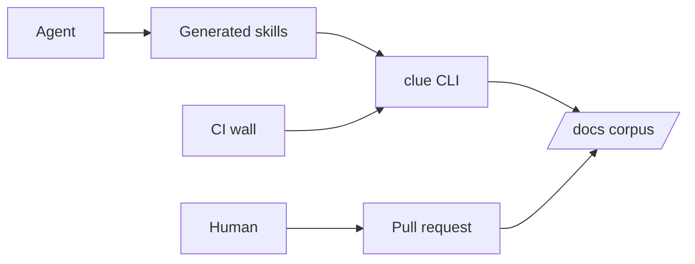

# Architecture

This is Cliewen's system-structure overview: the actors, boundaries, and durable technology choices that shape every capability. The cross-cutting runtime view is [design/](../design/README.md); capability-local implementation detail remains in each capability's `design.md`. Keep this page concise and update it when the system's structure changes.

<!-- clue:index:start -->
- [architecture.md](architecture.md) — actors, lifetime classes, the frontmatter graph
- [skills.md](skills.md) — the skills layer: why the set looks like it does, hand-offs, rules for future skills
- [ARCH-003 — The Cliewen core — three load-bearing elements, a red line, and an extensible periphery](core.md) · `active` — Defines the verifiable thread, human acceptance boundary, and deterministic judge as Cliewen's protected core, with adopter-extensible periphery around them.
<!-- clue:index:end -->
