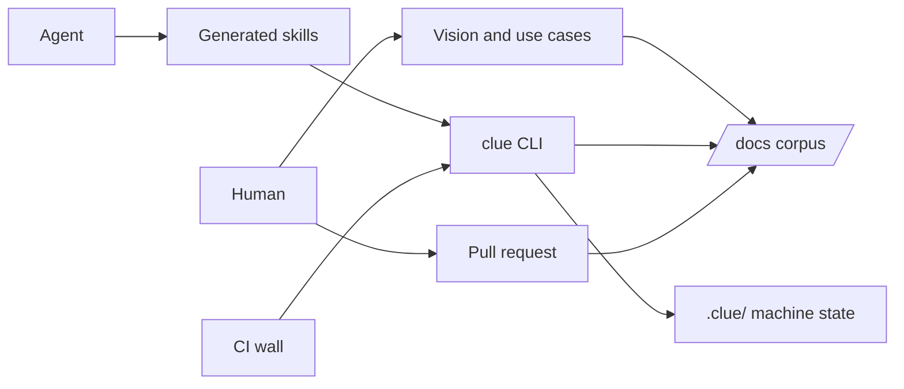

# Architecture

This is Cliewen's system-structure overview: the actors, boundaries, and durable technology choices that shape every capability. The cross-cutting runtime view is [design/](../design/README.md); capability-local implementation detail remains in each capability's `design.md`. Keep this page concise and update it when the system's structure changes.

**Two kinds of repository run this system, and they are not interchangeable.** This repository is Cliewen's *source*: it generates the skills and templates that an *adopter* receives, and it therefore carries rules — release process, generated-carrier parity, the shipped surface itself — that reach no adopter at all. Both kinds hold the same `docs/` shape, so the role is declared rather than inferred, in `.clue/role.yaml` ([ADR-062](../decisions/ADR-062-repository-role-is-declared-machine-state.md)). A repository with no marker is an adopter. `clue validate` applies the adopter-binding carrier rule only in the source repository, because it is the only one that ships anything.

`.clue/` holds derived machine state rather than authored prose: the identity ledger and the role marker. It is not a configuration layer, and nothing in it overrides a methodology rule.

**Two threads run through the corpus, and they meet only at the goal.** The intent thread — `VIS-001` (the vision, at `docs/vision.md`) → goal → optional `UC-xxx` use case → capability → criterion → evidence — says what the product means. The delivery thread — goal → plan → milestone → change → accepted merge — says how that meaning gets built, and never joins the semantic hierarchy. Intent links point down the composition, so a use case names the goal and capabilities it depends on and nothing names it back; `clue context` names the use cases reaching an artifact without following them ([ADR-066](../decisions/ADR-066-intent-links-point-down-and-context-names-what-points-back.md)). Both intent artifacts are optional to hold: a corpus with neither is valid, `clue init` writes a vision bootstrap only into a new repository, and `clue migrate` reports an absent vision without writing one, because nothing in a repository proves why a product exists ([ADR-065](../decisions/ADR-065-the-vision-is-a-singleton-at-a-fixed-address.md), [ADR-067](../decisions/ADR-067-a-corpus-without-a-vision-stays-valid.md)).

**The corpus keeps current truth, so artifacts leave it.** Retirement is deletion with Git history as the archive ([ADR-034](../decisions/ADR-034-retirement-is-deletion.md)); an analysis is the one artifact that accumulates by default, because a spike is a measurement pinned to a revision and nothing said when it was spent. An analysis now names where its findings landed, and `clue migrate` reports a spent one for a human to retire in a reviewed change ([PDR-052](../decisions/PDR-052-a-spent-analysis-is-reported-not-retained.md)) — unless a live decision or constraint still cites it, because a standing rule whose evidence is gone is readable but no longer reviewable ([PDR-053](../decisions/PDR-053-cited-evidence-stays-readable.md)). A completed plan is the exception a reader meets first: its `links:` may name a retired artifact, because a finished campaign records what it referenced rather than navigating anyone anywhere ([ADR-063](../decisions/ADR-063-a-frozen-plan-links-are-historical.md)). No command deletes a document.

<!-- clue:index:start -->
- [architecture.md](architecture.md) — actors, lifetime classes, the frontmatter graph
- [skills.md](skills.md) — the skills layer: why the set looks like it does, hand-offs, rules for future skills
- [ARCH-003 — The Cliewen core — three load-bearing elements, a red line, and an extensible periphery](core.md) · `active` — Defines the verifiable thread, human acceptance boundary, and deterministic judge as Cliewen's protected core, with adopter-extensible periphery around them.
<!-- clue:index:end -->
