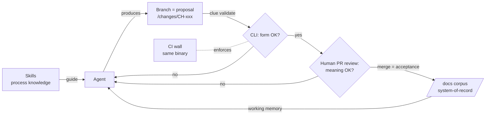
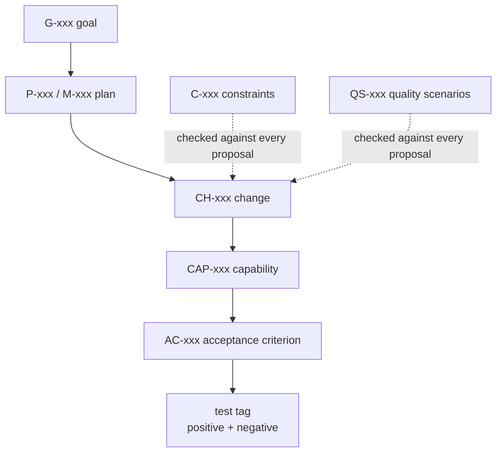

# Architecture

## The four actors

Process cannot drive humans, and agents cheat unless mechanically prevented. The division of labor:

| Actor | Role | One-liner |
|---|---|---|
| **Skills** (`.agents/skills/clue-*`) | Process knowledge | Tell the agent what the next right step is |
| **CLI (`clue`)** | Deterministic judge | Tells everyone whether it was done right |
| **CI** | The wall | Refuses to proceed if not (same binary as local) |
| **Human** | Decision-maker | Settles what machines cannot check: meaning |

Goodhart guard: **machines enforce form, humans verify meaning.** The linter checks that AC-042 has a test; only PR review checks the test means anything.

## Three artifact lifetime classes

1. **Permanent** — `/docs`. Lives forever, updated at every merge.
2. **Transient** — `/changes/<CH-xxx>/` on a branch only. Dies at merge, digested into permanent docs. CI gate: `main` never contains `/changes/`.
3. **Campaign** — `/docs/plans`. Live on `main`, mutate continuously (bookkeeping in digests, semantic changes via ADR-backed revisions), frozen immutable at `status: completed` — never deleted.

Git is the engine: the branch is the proposal, the PR is the review gate, the merge commit is the acceptance, and `git log docs/` is the provenance archive. Repo-native, never forge-native.

## The frontmatter graph

Every artifact carries YAML frontmatter (`id`, `type`, `status`, `links`, `title` + small type-specific extensions). `clue` discovers artifacts by scanning frontmatter, never by path: **the ID is the identity, the path is only the current address.** Every field must have a consumer — a field neither `clue` nor a skill reads gets removed.

## Deliberately out (doors defined, doors closed)

Deployment/operations (V3 door: production findings enter as new goals or constraints); external constraint catalogs (plug in via `source:`); `enforcement:` classes beyond `machine`; kernel/profile layering (extracted after multiple working instances, not designed from zero).
