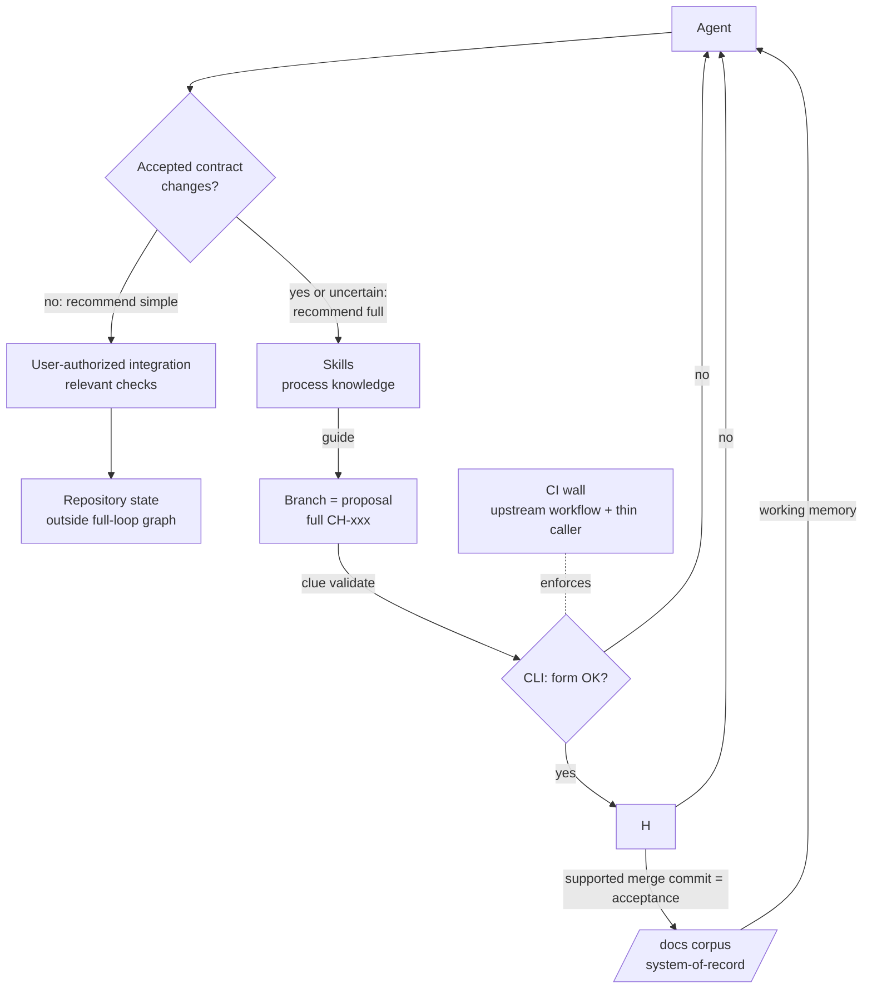
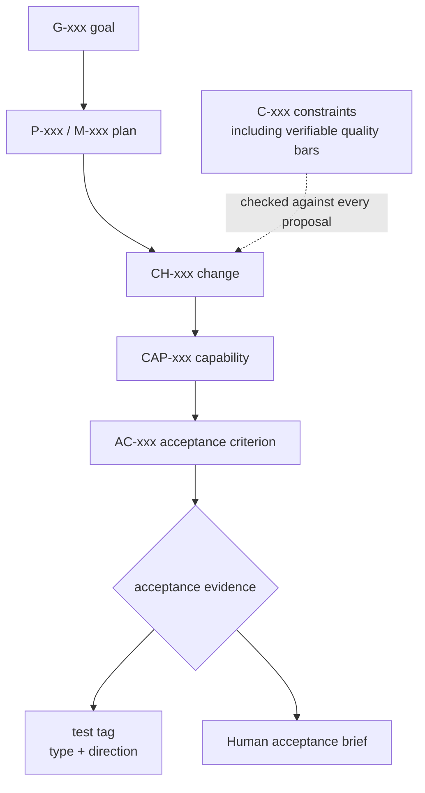

# Architecture

## The four actors

Process cannot drive humans, and agents cheat unless mechanically prevented. The division of labor:

| Actor | Role | One-liner |
|---|---|---|
| **Skills** (`.agents/skills/clue-*`) | Process knowledge | Tell the agent what the next right step is |
| **CLI (`clue`)** | Deterministic judge | Tells everyone whether it was done right; also materializes the starting point (`clue init`, [ADR-018](../decisions/ADR-018-init-templates-embedded.md)), resolves what the corpus points at outside itself without ever reaching a verdict (`clue refs`), reports whether a newer release exists and how to install it here — reaching the network, writing nothing, and never reaching a verdict either (`clue latest`, [ADR-042](../decisions/ADR-042-release-check-outside-the-judge.md)), regenerates the index blocks (`clue scaffold`, [ADR-019](../decisions/ADR-019-init-regenerates-indexes.md)), and previews or applies safe release migrations (`clue migrate`, [ADR-039](../decisions/ADR-039-versioned-corpus-migrations.md)) |
| **CI** | The wall | Refuses to proceed if not (same binary as local) |
| **Human** | Decision-maker | Settles what machines cannot check: meaning |

Goodhart guard: **machines enforce form, humans verify meaning.** The linter checks that AC-042 has the evidence its declared proof class requires; only the human merge judges whether executable evidence or a Human acceptance brief actually proves the intended behavior.

```mermaid
flowchart TD
    A[Agent] --> Q{Accepted contract<br/>changes?}
    Q -->|no: recommend simple| P[User-authorized integration<br/>relevant checks]
    P --> R[Repository state<br/>outside full-loop graph]
    Q -->|yes or uncertain:<br/>recommend full| S[Skills<br/>process knowledge]
    S -->|guide| B[Branch = proposal<br/>full CH-xxx]
    B -->|clue validate| C{CLI: form OK?}
    C -->|no| A
    C -->|yes| H
    H -->|no| A
    H -->|supported merge commit = acceptance| D[/docs corpus<br/>system-of-record/]
    D -->|working memory| A
    W[CI wall<br/>upstream workflow + thin caller] -.enforces.- C
```

## Three artifact lifetime classes

1. **Permanent** — `/docs`. Lives forever; every change assesses its documentation impact and updates the affected truth.
2. **Transient** — `/changes/<CH-xxx>/` on a branch only. Dies at merge, digested into permanent docs. CI gate: `main` never contains `/changes/`.
3. **Campaign** — `/docs/plans`. Live on `main`, mutate continuously (bookkeeping in digests, semantic changes via ADR-backed revisions), frozen immutable at `status: completed` — never deleted.

Git is the engine: for a chosen full loop the branch is the proposal, the PR is the review gate, the supported merge commit is acceptance, and reachable history is the provenance archive. Simple work stays outside that graph and follows explicit user authority and repository policy; a declined full recommendation is retained in vendor-neutral Git trailers ([PDR-042](../decisions/PDR-042-routing-recommends-contract-aware-effort.md)). Repo-native, never forge-native.

## The frontmatter graph

Every artifact carries YAML frontmatter (`id`, `type`, `status`, `links`, `title` + small type-specific extensions). `clue` discovers artifacts by scanning frontmatter, never by path: **the ID is the identity, the path is only the current address.** Every field must have a consumer — a field neither `clue` nor a skill reads gets removed.

```mermaid
flowchart TD
    G[G-xxx goal] --> P[P-xxx / M-xxx plan]
    P --> CH[CH-xxx change]
    CH --> CAP[CAP-xxx capability]
    CAP --> AC[AC-xxx acceptance criterion]
    AC --> E{acceptance evidence}
    E --> T[test tag<br/>type + direction]
    E --> H[Human acceptance brief]
    C[C-xxx constraints<br/>including verifiable quality bars] -. checked against every proposal .-> CH
```

## Deliberately out (doors defined, doors closed)

Deployment/operations (V3 door: production findings enter as new goals or constraints); external constraint catalogs (plug in via `source:`); kernel/profile layering (extracted after multiple working instances, not designed from zero). The `enforcement:` classes beyond `machine` door was opened by ADR-017 and widened by [ADR-045](../decisions/ADR-045-register-names-the-machine.md): a rule states the machine that holds it and the judgment that remains, `partial` covers the ordinary case where both are true, and `agent` is what is left of the promotion backlog — reported on the OK line, and silent at zero.
