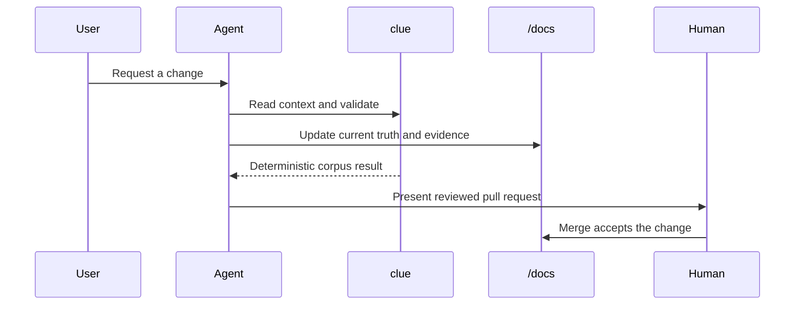
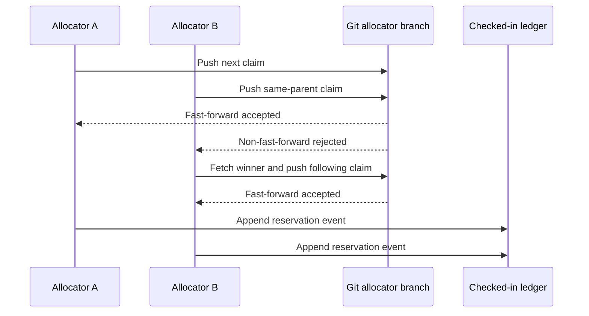

# Design

This is Cliewen's cross-cutting behaviour overview. It explains how the agent workflow, deterministic CLI, durable corpus, CI wall, and human acceptance boundary work together. [Architecture](../architecture/README.md) covers their static boundaries; capability designs hold local implementation detail.

Intent enters the same loop from a different side. When a repository states no direction, the agent elicits one in conversation (greenfield) or infers a cited draft from repository evidence (brownfield); `clue` reports whether one exists and never interviews or infers, and the human accepts meaning at the merge boundary like everything else ([PDR-055](../decisions/PDR-055-intent-discovery-divides-interview-inference-and-acceptance.md)). Drafted intent stays `draft` with `provenance: inferred` until a human confirms it, which is the corpus's existing way of separating what was concluded from what was agreed. A full change's acceptance brief names the vision it proceeds under, or states that the repository has none ([C-023](../constraints/C-023-full-work-discloses-its-vision.md)). `clue next` is the read-only orientation path for the delivery thread: it derives candidates from active plan tables and leaves selection and plan-health judgement with the human and agent.

Parallel identity allocation is a separate operational flow. It uses Git as the compare-and-swap transport without making the remote part of corpus judgment ([ADR-068](../decisions/ADR-068-git-serializes-identity-claims.md)).

Only reservation claims cross the remote boundary. A feature branch's `live` and `retired` events stay in its checked-in ledger, so an abandoned branch cannot make accepted repository state claim that an artifact exists. Independent event lines merge with Git's union driver; loading folds them monotonically and validation rejects contradictory identity metadata.

The feedback loop is deliberate: a change first asks which durable document a reader will need, updates that document only when the system truth changed, then verifies the corpus against the same revision. Decisions explain why a future choice constrains work and link here or to architecture when they affect this view; they do not duplicate it. Diagrams belong here when they make an interaction or flow easier to review than prose.

<!-- clue:index:start -->
<!-- clue:index:end -->
