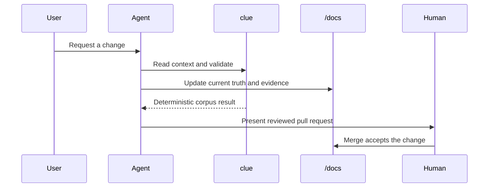

# Design

This is Cliewen's cross-cutting behaviour overview. It explains how the agent workflow, deterministic CLI, durable corpus, CI wall, and human acceptance boundary work together. [Architecture](../architecture/README.md) covers their static boundaries; capability designs hold local implementation detail.

The feedback loop is deliberate: a change first asks which durable document a reader will need, updates that document only when the system truth changed, then verifies the corpus against the same revision. Decisions explain why a future choice constrains work and link here or to architecture when they affect this view; they do not duplicate it. Diagrams belong here when they make an interaction or flow easier to review than prose.

<!-- clue:index:start -->
<!-- clue:index:end -->
