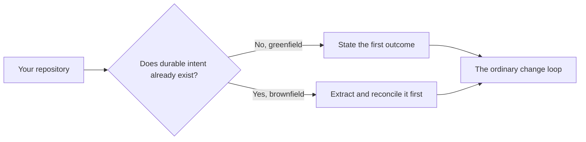

# Greenfield and brownfield

Cliewen works for new systems and systems with years of history. The first step differs: a greenfield project can state its intended outcomes directly, while a brownfield project must find and reconcile the intent that already exists.

## Who keeps the documentation current?

Tell the agent what outcome you want. You should not have to mirror every code change into `/docs` by hand. The agent reads `AGENTS.md`, loads the relevant Cliewen skill, and updates the implementation and durable corpus together on the same branch.

`clue validate` checks the parts a machine can judge: artifact structure, links, generated indexes, and traceability from active acceptance criteria to their declared acceptance evidence. A human still reviews whether the documentation and implementation say the right thing.

This is agent-maintained documentation, not background synchronization. `clue` does not watch a wiki or ticket system, and it does not invent missing intent from code. A chosen full loop requires local validation before its pull request is ready. Once the [generated CI caller](./ci-wall) is armed and its upstream validation job is required, broken traceability blocks integration. Simple work runs the checks relevant to its surfaces without full-loop bookkeeping.

## Start with the minimum

Do not fill every corpus folder because the scaffold created it. A useful first thread needs four things:

| Record | Question it answers |
|---|---|
| Goal | Who needs an outcome, and why? |
| Capability | What must the system be able to do? |
| Acceptance criterion | What observable example makes the behavior specific enough to accept? |
| Acceptance evidence | Does the behavior work, and does it reject or survive the important counter-case — or, for a genuinely human judgment, does the acceptance brief put that proof in front of the person who merges? |

Your agent writes those four records; you state the outcome. The rules below let you check its work. You do not need to memorize them before starting.

::: details The exact evidence rules for a criterion

The criterion carries a canonical stable ID such as `AC-001`, `SNAP-SQS-001`, or `ADP-045b`: uppercase segmented prefixes, decimal digits, and optional lowercase letter suffixes are exact in the corpus. A new or revised machine-proven criterion declares `Test-type: Unit`, `Integration`, `E2E`, or `Performance`; focused positive and negative evidence both reference its ID and declared type through supported Go test names such as `TestSNAPSQS001_UnitPositive_…`, per-executable JVM JUnit method tags or the stable JVM test-name form, or Cucumber scenario tags. A JVM executable carries all three evidence parts itself; class tags and unrelated methods cannot supply missing parts. A genuinely one-direction scenario says `(single-direction)`. `Test-type: Human` instead uses the pull request acceptance brief as its proof and needs no code reference. If one criterion is not ready, add `@draft` to that criterion's tag line while its proven siblings and active capability remain active.

`clue validate` classifies and counts the pair for a declared machine proof type, recognizes explicit single-direction and per-criterion `@draft` cases, treats a Human declaration as requiring no code evidence, and preserves the older one-supported-reference rule for unannotated legacy criteria. It cannot check that the acceptance brief supplies Human proof; the pull request workflow and human merge gate do that. It validates executable evidence references but does not run the tests; the repository's normal test runner remains responsible for execution.

:::

## Add the wider corpus when it earns its keep

The rest of the taxonomy solves problems that appear as work grows:

| Add | When |
|---|---|
| A plan | The outcome needs several ordered changes or milestones |
| A decision record | Reversing a choice later would be expensive, or the repository needs to remember why one path won |
| A constraint | Law, policy, compatibility, licensing, another non-negotiable boundary, or a system quality (performance, reliability, usability) needs a concrete, checked threshold |
| Architecture | Several capabilities depend on the same boundary or an expensive-to-change structure |
| Analysis findings | Important unknowns need investigation before anyone can plan honestly |

Leave unused categories empty. Cliewen is supposed to expose necessary reasoning, not reward document volume.

## When Cliewen is a poor fit

Do not adopt Cliewen when the repository cannot own both the intent and its acceptance evidence. The current method is also a poor fit when:

- Work does not go through Git branches and a human-controlled merge boundary.
- The project cannot run reliable tests or enforce a stable CI check before integration.
- The code is a disposable prototype, generated output, or vendored source whose behavior is accepted somewhere else.
- One corpus would need to claim test evidence spread across several repositories. Current validation is repository-local.
- The team will not let agents update the corpus with the implementation or will not review the meaning before merge.

In those cases, use the project's existing lightweight notes and tests instead of creating a corpus nobody will maintain.

## Tell the agent in ordinary words

You do not need to speak Cliewen's internal language. Describe what you want and the repository's `AGENTS.md` tells the agent which workflow to follow. [How to prompt the agent](./prompting) collects the prompts worth copying: a greenfield start, a brownfield adoption, a routine change, and picking the work up again after time away.

## Adopt one existing repository

Use `clue-extract` once when the repository already contains specifications, decision notes, tagged tests, or other durable intent.

Extraction converts meaning, not just files. After proposing its full change, the agent writes a report-only rehearsal in that change's `/changes/` workspace. It inventories the source, proposed mappings, ID preservation or minting, uncertainty, test-purpose work, instruction conflicts, planned deletions, and plan doors without changing the target corpus, tests, routing, or hosted state. An unresolved conflict becomes an open question.

Only explicit human direction starts the mutation phase. That phase digests the rehearsal into the durable extraction report and removes the old parallel specification corpus before the pull request is ready. The report's criterion counts and mapping table live in one region rendered by `clue report` from the pinned source manifest that `clue parity` compares. `clue validate` renders it again, so the report cannot describe a different corpus from the one the migration checked.

The report is a readable summary, not a committed registry of every criterion. To inspect one mapping, follow its manifest reference and read the pinned manifest beside the target corpus or `clue parity` output. This adds one navigation step but avoids maintaining two versions of the same mapping.

Every extracted artifact starts inferred. Non-decision artifacts use `provenance: inferred` and `reversal-cost: low|high` to show whether their meaning is cheap and local or expensive to reverse. Decisions use `status: inferred` and `author: agent` because ADR/PDR routing already treats them as expensive. Human review promotes only meaning it verifies. An active capability cannot depend on high-cost inferred meaning in its immediate graph slice, while low-cost findings may remain deferred.

Two extraction mappings ship today. OpenSpec, as extended in [Intent Engineering for Coding Agents](https://intent-engineering-for-coding-agents.github.io/book/): stock OpenSpec does not tag scenarios with stable IDs, so the mapping expects the book's conventions, specs become capabilities, scenario IDs survive as acceptance-criterion IDs so existing test tags keep working, and archived changes remain Git history. MADR, including the older Nygard heading-only form the same folders often mix in: the numeric filename prefix survives as the decision's ID, every converted record is born `inferred` because an agent wrote it and no human has yet verified it here — `accepted` in the source is emphatically not a shortcut to `verified` — and acceptance that predates the corpus is preserved as body prose rather than written into `accepted-by:`, which stays reserved for approval given under this repository's own merge boundary. If the source format has no extraction mapping yet, writing that mapping is the first extraction task.

## When the system spans repositories, wikis, and tickets

A `clue-analysis` discovery pass is useful when evidence and ownership are distributed across several systems. It can establish what the sources are, how fresh they are, and where they disagree before you choose which repository-local extractions to propose. [How to prompt the agent](./prompting#when-the-honest-answer-is-lets-find-out-first) has the wording for asking that instead of asking for a migration.

Wiki pages and tickets can be evidence, preferably through revision-pinned links or stable exports. They do not become a second system of record, and Cliewen does not live-sync them after adoption.

The current tooling has a deliberate repository boundary:

- `clue-extract` adopts one repository at a time.
- `clue validate` discovers acceptance evidence only inside the repository being validated.
- Several repositories can be adopted separately, each with its own corpus and local test evidence.
- One unified corpus that claims acceptance evidence from tests spread across several repositories is not supported yet. Supporting it would require a future capability rather than a broader reading of the current tools.

## Next

[Learn what to type to get useful work started.](./prompting)
