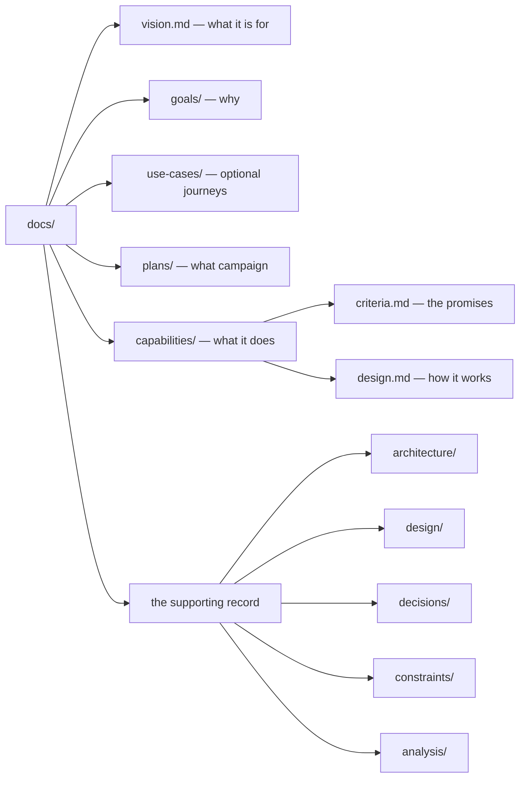

# The corpus

The `docs/` folder is the corpus: the permanent record of what your system is for, what it can do, how it is built, and why. Agents read it before they work and update it in the same pull request as the code, so the next session starts from this record rather than from a lost chat. You review it alongside the implementation, and Git keeps every accepted version.

The corpus describes the system as it is now. It is not an archive of past change requests. A full change's proposal lives in a temporary `/changes/` folder while the work is in progress, and it is folded into `docs/` and deleted before merge.

## The taxonomy



| Folder | Artifact | Question it answers |
|---|---|---|
| `vision.md` | `VIS-001` | What is this product or system for, and what is outside it? |
| `goals/` | `G-xxx` | Who needs an outcome, and why? |
| `use-cases/` | `UC-xxx` | What does one actor do end to end, across capabilities? (optional) |
| `plans/` | `P-xxx` with `M-xxx` milestones | What bounded campaign moves a goal forward? |
| `capabilities/` | `CAP-xxx` with criteria and design | What can the system do, how is it verified, and how is it built? |
| `architecture/` | `README.md`, plus `ARCH-xxx` when needed | What are the system's parts, boundaries, and lasting technology choices? |
| `design/` | `README.md` | How do flows and shared patterns work across capabilities? |
| `decisions/` | `ADR-xxx`, `PDR-xxx`, and `IDR-xxx` | Why is the architecture, project, or implementation shaped this way? |
| `constraints/` | `C-xxx` | What rule must every relevant change obey, including a measurable quality bar such as a coverage floor? |
| `analysis/` | `AN-xxx` | What did a time-boxed investigation find? |

Each folder has a README that explains its type and contains a generated index of the artifacts beside it. `docs/README.md` is the entry point for people and agents. The vision and the use cases are both optional: a corpus with neither is valid, and nothing counts them. [Vision and use cases](./intent) covers when each one is worth writing.

## Identity is not location

Every artifact begins with YAML frontmatter:

```yaml
---
id: CAP-002
type: capability
status: active
links: [G-001]
title: clue validate
goal: G-001
---
```

The ID is the identity, and the path is only where the file happens to be. `clue` finds artifacts by reading frontmatter. It checks IDs and status values, resolves every `links` entry, and verifies that the generated indexes match the files on disk. A file can move without becoming a different capability, while a duplicate ID or a broken link fails loudly.

Links point down the thread: a goal names the vision, a capability names its goal, and a use case names the goal and the capabilities it crosses. Nothing links back up, so each connection is written in one place and cannot drift apart.

## Statuses

Most artifacts start as `draft` and become `active`. That default also applies to any artifact type you add yourself under `docs/`, so you can extend the corpus without changing the tool. A few types follow their own lifecycle:

| Type | Statuses | Why |
|---|---|---|
| goal | `proposed` → `accepted` | Proposed goals are the inbox for ideas nobody has committed to yet. Accepting one says it is real, not that it must be built now. |
| plan | `draft` → `active` → `completed` | A completed plan is frozen and never deleted, so the plan index also records what the project achieved. |
| decision | `inferred` → `verified` | An agent-recorded decision starts `inferred`. Merging makes it binding, and a human's explicit approval later marks it `verified`. |

Something an agent drafted or extracted without a human confirming it carries `provenance: inferred`. A vision an agent drafted, for instance, stays `status: draft` with `provenance: inferred` until you confirm it. `clue validate --intent` reports that state rather than hiding it.

## Which document to update

A fact kept in two places will eventually disagree with itself, so each kind of fact has one home:

- `docs/architecture/README.md` explains the system's actors, components, boundaries, and lasting technology choices. Update it when a change alters the system's structure or public surface.
- `docs/design/README.md` explains flows, interactions, and patterns that cross capabilities.
- A capability's `design.md` holds the detail that belongs to that capability alone.
- A decision explains why a choice constrains future work. It links to the overview instead of repeating it.
- Findings record what an investigation observed. They do not quietly become accepted intent.

`clue init` writes both overviews as marked placeholders, and `clue validate` stays red until they contain your repository's real structure. On every change the agent checks whether one of these documents needs updating, and says in the handoff which changed or why none did.

## Choose the right decision record

First ask whether the choice constrains future work. If it does, route it by subject:

| Decision | Record |
|---|---|
| Software architecture or the corpus format | An ADR, or Architectural Decision Record |
| Project workflow, process, or methodology | A PDR, or Project/Process Decision Record |
| Implementation | An IDR, or Implementation Decision Record |

Routine facts, chronology, and implementation history are not decision records. ADRs, PDRs, and IDRs keep the context and decision, with alternatives and consequences only when they will help a future reader.

## How the corpus lets go

A corpus that only grows gets slower for every reader, human or agent. Cliewen has no `retired` status. To retire an artifact, delete its file and name its ID in the `supersedes:` field of the artifact that replaces or carries it. Git history keeps the old file.

Analysis documents are the usual candidates. A spike records what was true at the revision it looked at, so it is not permanent truth. When its findings have reached a lasting home, such as an overview, a decision, or a capability, the analysis names that home in `carried-by: [ID, …]`. Once every plan the analysis served is complete and no live decision or constraint still cites it, a `clue migrate` preview lists it as a candidate for retirement (notice `MIG-013`). No command deletes anything. The agent asks you about each document, one at a time, and retires the ones you approve in their own reviewed change. Never empty a document instead of deleting it: that keeps its index row and its reading cost while throwing away the part with value.

A completed plan is the one place a link to a retired artifact may remain, because the plan records what its campaign used while it ran.

## Index rows

Each folder README has a generated index between `clue:index` markers. A row has the artifact's identity, a status badge, and a sentence about the artifact. The sentence is yours: it is seeded once from the artifact's body, and regeneration never rewrites it. The badge belongs to the generator, and `clue scaffold` refreshes it on every run, so a row cannot keep showing a status the artifact no longer has.

## The `.clue/` folder

Next to `docs/`, a small `.clue/` folder holds machine state:

| File | What it holds |
|---|---|
| `role.yaml` | `role: adopter`. Cliewen's skills read it before applying a rule that only applies in Cliewen's own source repository. A repository without it is treated as an adopter. |
| `id-ledger.yaml` | Every identity handed out by `clue id next`, so two changes do not claim the same number. |
| `id-coordination.yaml` | Present once a team switches to coordinated allocation through a Git remote. [Operate safely](./operations#coordinate-identity-allocation-for-a-team) explains when you need it. |

## Reading the corpus

Agents do not read the whole corpus for each task. They read a bounded slice:

- `clue context <id>` prints one artifact and the artifacts it links to, one hop by default. `--depth=<n>` follows more hops, `--stats` prints the size of the slice, and the output names anything the bound held back. An acceptance-criterion or milestone ID resolves to the file that declares it. Use cases that name the artifact are listed by identity, title, and path, without their content.
- `clue next` reports the first unfinished milestone in an active plan, and `clue next --all` lists the alternatives.
- `clue validate --intent` prints the vision the corpus states, its provenance, and the use cases it has.

You can use the same commands to find your way around.

## See a living corpus

Cliewen runs on itself. Browse its [corpus entry point](https://github.com/cliewen/cliewen/blob/main/docs/README.md), its [plan index](https://github.com/cliewen/cliewen/blob/main/docs/plans/README.md), or the [validator capability](https://github.com/cliewen/cliewen/tree/main/docs/capabilities/CAP-002-validate) to see real artifacts rather than a toy example.

## Next

[See how a corpus states what the product is for.](./intent)
