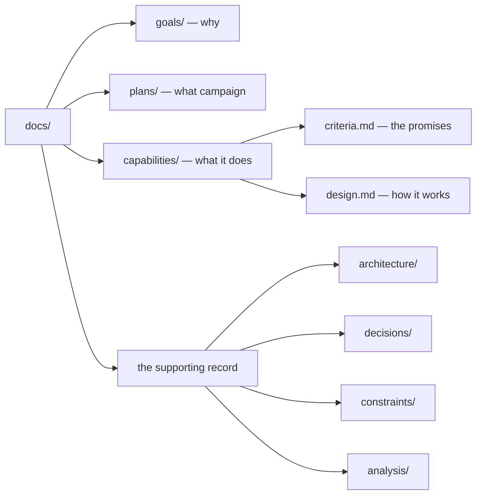

# The corpus

The `/docs` tree is Cliewen's permanent working memory. After classifying a task, agents read the slice from `clue context <id>` and use `--depth` only when the task needs another linked artifact. People review durable artifacts with the implementation, and Git records every accepted change.

## The taxonomy



| Folder | Artifact | Question it answers |
|---|---|---|
| `goals/` | `G-xxx` | Who needs an outcome, and why? |
| `plans/` | `P-xxx` with `M-xxx` milestones | What bounded campaign moves a goal forward? |
| `capabilities/` | `CAP-xxx` with criteria and design | What can the system do, how is it verified, and how is it built? |
| `architecture/` | `ARCH-xxx` | What describes the whole system or an expensive-to-change boundary? |
| `decisions/` | `ADR-xxx`, `PDR-xxx`, and `IDR-xxx` | Why is the architecture, project, or implementation shaped this way? |
| `constraints/` | `C-xxx` | What rule must every relevant change obey — including a verifiable quality bar such as a coverage floor? |
| `analysis/` | `AN-xxx` | What did a time-boxed investigation find? |

Each folder has a README that explains its type and contains a generated index of the artifacts beside it.

## Identity is not location

Every artifact begins with YAML frontmatter:

```yaml
---
id: CAP-002
type: capability
status: active
links: [G-001]
title: clue validate
goal: G-001
---
```

The ID is the identity; the path is only its current address. `clue` scans frontmatter, checks IDs and status vocabularies, resolves every `links` entry, and verifies that generated indexes match the files on disk.

This makes refactoring the corpus safe. A file can move without becoming a different decision or capability, while duplicate IDs and broken references fail loudly.

`clue context <id>` turns identity into a reading path: it prints the declaring artifact first, then follows outgoing `links` in deterministic order out to a stated depth, naming the artifacts the bound held back. Criterion and milestone IDs resolve to their owning criteria or plan artifact. It does not follow reverse links, because starting from a shared goal would otherwise pull most of a mature corpus into one result.

## One home per scope

System-wide and expensive-to-change design belongs under `architecture/`. Per-capability design lives beside the capability. Decisions explain durable choices but do not become substitute design documents. Findings record what an investigation observed but do not silently become accepted intent.

The separation is strict for a practical reason: a fact with two homes will eventually disagree with itself.

## Choose the right decision record

First ask whether the choice constrains future work. If it does, route it by subject:

| Decision | Record |
|---|---|
| Software architecture or the corpus format | An ADR, or Architectural Decision Record |
| Project workflow, process, or methodology | A PDR, or Project/Process Decision Record |
| Implementation | An IDR, or Implementation Decision Record |

Routine facts, chronology, and implementation history are not decision records. ADRs, PDRs, and IDRs keep the context and decision, with alternatives and consequences only when they will help a future reader.

## See a living corpus

Cliewen dogfoods the methodology. Browse its [corpus entry point](https://github.com/cliewen/cliewen/blob/main/docs/README.md), [active campaign](https://github.com/cliewen/cliewen/blob/main/docs/plans/P-007-core-hardening.md), or [validator capability](https://github.com/cliewen/cliewen/tree/main/docs/capabilities/CAP-002-validate) to see real artifacts rather than a toy example.

## Next

[Read why Cliewen is designed the way it is.](./design)
