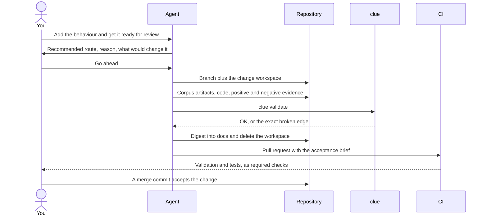

# What one change produces

This page traces one small change from your request to a merge commit. It shows the artifacts and command output from a real `clue 0.18.0` run in a disposable repository.



## 1. The prompt

```text
Please add a greeting that can be requested by name, and refuse an empty name. Get it ready for review.
```

## 2. The route recommendation comes back first

Nothing is edited before you see a sentence like this one:

```text
Recommended route: full. This adds a capability and a new acceptance criterion, so it changes
the accepted contract. What would change the recommendation: discovering that an existing
criterion already promises this, which would make it a defect correction and therefore simple.
```

This is where you can disagree. Once you say go ahead, the agent starts work.

## 3. It takes an identity and a branch

```text
$ clue id next CH
CH-001
```

On a repository that has never allocated an identity, the ledger has to exist first, and `clue` says so rather than guessing:

```text
clue id next: identity ledger is missing; run `clue migrate --apply` first
```

```text
$ clue migrate --apply
clue migrate: apply for target pair 0.18.0
MIG-008 .clue/id-ledger.yaml: seed the identity ledger with 2 live id(s) from the current corpus scan
clue migrate: applied 1 file(s)
```

The identity comes from the ledger, not Git history. An identifier once used by a deleted artifact is never minted again. The branch takes the same name: `ch-001-greet-by-name`.

## 4. It writes the proposal before it writes any code

```text
changes/CH-001-greet-by-name/
├── proposal.md         what and why, and the plan item it serves
├── tasks.md            an ordered checklist, dependencies first
└── open-questions.md   blocking questions; when one appears, work stops
```

This is a transient workspace, not documentation. It is committed and pushed as a draft pull request immediately, so the work is visible instead of sitting in one person's local checkout.

```markdown
---
id: CH-001
type: change
status: open
links: []
title: A greeting can be requested by name
---

# CH-001 — A greeting can be requested by name

Plan-less: this repository has no plan yet, and this change deliberately declares itself plan-less.
```

`clue validate` already validates the workspace itself:

```text
clue validate: OK (5 artifacts)
```

## 5. The corpus gains the durable part

The permanent record is `docs/`, and this change adds three files to it:

```text
docs/goals/G-001-greeting.md                        who needs the outcome, and why
docs/capabilities/CAP-001-greeting/README.md        what the system can now do
docs/capabilities/CAP-001-greeting/criteria.md      the acceptance criterion, as tagged Gherkin
```

The criterion is the central artifact. It has a stable identity and declares how it will be proven:

````markdown
```gherkin
Feature: Return a greeting

  @AC-001
  Scenario: Greet a supplied name
    Test-type: Unit
    Given the name "Ada"
    When a greeting is requested
    Then the result is "Hello, Ada"
    And an empty name is refused
```
````

Indexes are generated, never hand-maintained:

```text
$ clue scaffold
indexed  docs/capabilities/README.md
indexed  docs/goals/README.md
clue scaffold: 2 index block(s) regenerated
```

## 6. The evidence is named by the criterion it proves

The implementation is ordinary code. Its tests carry the criterion identity, declared test type, and direction in their names.

```go
func TestAC001_UnitPositive_GreetsASuppliedName(t *testing.T) { … }

func TestAC001_UnitNegative_RefusesAnEmptyName(t *testing.T) { … }
```

Delete the negative one and the judge names exactly what is missing, by criterion and by direction:

```text
docs/capabilities/CAP-001-greeting/criteria.md: AC-001 has no Unit negative evidence (ADR-032)
clue validate: 1 issue(s)
```

With both directions present, the thread is intact:

```text
$ clue validate
clue validate: OK (8 artifacts)
```

Note what that verdict does *not* claim. `clue` checked that the evidence exists, is classified, and points at a live criterion. Whether the tests pass is your test runner's job:

```text
$ go test ./...
ok      example.com/greeting    0.264s
```

## 7. The digest deletes the workspace

The proposal and checklist are scaffolding. Once the durable corpus captures everything the change means, the workspace is deleted. That deletion *is* the digest, so it is never a separate task.

Before the digest, CI's stricter invocation refuses the branch:

```text
$ clue validate --forbid-changes
changes: transient workspace present — digest before merge (main must never contain /changes)
clue validate: 1 issue(s)
```

After it, the same command is green, and `main` never learns that `/changes/` existed:

```text
$ clue validate --forbid-changes
clue validate: OK (5 artifacts)
```

## 8. The pull request states what merging would accept

The agent marks the draft ready with an acceptance brief at the top of the body. It names the plan item and whether it is still wanted, every added or changed criterion with its verdict, any `Test-type: Human` criterion whose proof is that brief line, and what the merge binds. Keep it to one screen with no placeholders. If it cannot fit, split the change.

Then it stops. The last act is yours: a human-controlled merge commit accepts the change, and the reachable history keeps the proposal, the implementation, the digest, and the corpus together.

## Next

[See the same loop written out as a procedure.](./change-loop)
