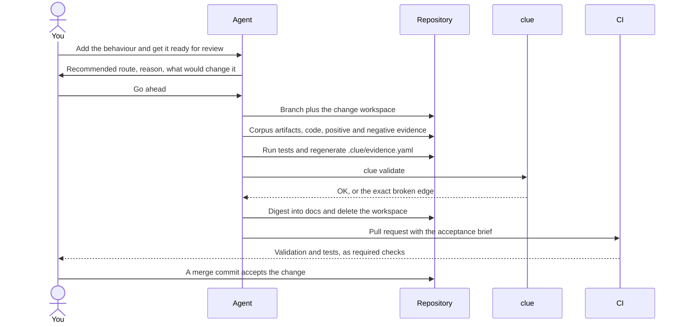

# What one change produces

This page traces one small change from your request to a merge commit. It illustrates the artifacts and commands used with `clue 0.27.0`. Output excerpts show the relevant verdicts; artifact counts depend on the repository.


```mermaid
sequenceDiagram
  actor You
  participant Agent
  participant Repo as Repository
  participant Clue as clue
  participant CI
  You->>Agent: Add the behaviour and get it ready for review
  Agent->>You: Recommended route, reason, what would change it
  You->>Agent: Go ahead
  Agent->>Repo: Branch plus the change workspace
  Agent->>Repo: Corpus artifacts, code, positive and negative evidence
  Agent->>Repo: Run tests and regenerate .clue/evidence.yaml
  Agent->>Clue: clue validate
  Clue-->>Agent: OK, or the exact broken edge
  Agent->>Repo: Digest into docs and delete the workspace
  Agent->>CI: Pull request with the acceptance brief
  CI-->>You: Validation and tests, as required checks
  You->>Repo: A merge commit accepts the change
```

## 1. The prompt

```text
Please add a greeting that can be requested by name, and refuse an empty name. Get it ready for review.
```

## 2. The route recommendation comes back first

Nothing is edited before you see a sentence like this one:

```text
Recommended route: full. This adds a capability and a new acceptance criterion, so it changes
the accepted contract. What would change the recommendation: discovering that an existing
criterion already promises this, which would make it a defect correction and therefore simple.
```

This is where you can disagree. Once you say go ahead, the agent starts work.

## 3. It takes an identity and a branch

```text
$ clue id next CH
CH-001
```

On a repository that has never allocated an identity, the ledger has to exist first, and `clue` says so rather than guessing:

```text
clue id next: identity ledger is missing; run `clue migrate --apply` first
```

```sh
clue migrate
clue migrate --apply
```

Preview the migration before applying it. The command can seed a missing ledger, but it does not export test evidence for you.

The identity comes from the ledger, not Git history. An identifier once used by a deleted artifact is never minted again. The branch takes the same name: `ch-001-greet-by-name`.

In a team repository, a maintainer enables coordinated allocation once, commits both files the command writes, and merges them before contributors branch:

```text
$ clue id coordinate --remote=origin
identity allocation coordinated through origin:refs/heads/clue/id-allocator
commit .clue/id-ledger.yaml and .clue/id-coordination.yaml together, then merge them before contributors branch
protect the allocator branch from force-push and deletion while allowing ordinary fast-forward pushes
```

After that, `clue id next CH` claims its number through the remote allocator branch. Clones and worktrees can allocate at the same time without receiving the same number. Until coordination is enabled, the command warns that allocation is local; teams must serialize it on their integration branch.

## 4. It writes the proposal before it writes any code

```text
changes/CH-001-greet-by-name/
├── proposal.md         what and why, and the plan item it serves
├── tasks.md            an ordered checklist, dependencies first
└── open-questions.md   blocking questions; when one appears, work stops
```

This is a transient workspace, not documentation. It is committed and pushed as a draft pull request immediately, so the work is visible instead of sitting in one person's local checkout.

```markdown
---
id: CH-001
type: change
status: open
links: []
title: A greeting can be requested by name
---

# CH-001 — A greeting can be requested by name

Plan-less: this repository has no plan yet, and this change deliberately declares itself plan-less.
```

`clue validate` already validates the workspace itself:

```text
clue validate: OK (...)
```

## 5. The corpus gains the durable part

The permanent record is `docs/`, and this change adds three files to it:

```text
docs/goals/G-001-greeting.md                        who needs the outcome, and why
docs/capabilities/CAP-001-greeting/README.md        what the system can now do
docs/capabilities/CAP-001-greeting/criteria.md      the acceptance criterion, as tagged Gherkin
```

The criterion is the central artifact. It has a stable identity and declares how it will be proven:

````markdown
```gherkin
Feature: Return a greeting

  @AC-001
  Scenario: Greet a supplied name
    Test-type: Unit
    Given the name "Ada"
    When a greeting is requested
    Then the result is "Hello, Ada"
    And an empty name is refused
```
````

Indexes are generated, never hand-maintained:

```text
$ clue scaffold
indexed  docs/capabilities/README.md
indexed  docs/goals/README.md
clue scaffold: 2 index block(s) regenerated
```

## 6. Tests carry metadata, and the exporter records it

The implementation is ordinary code. Prefer native test metadata or an executable-bound custom annotation. Go tests can use a stable naming fallback:

```go
func TestAC001_UnitPositive_GreetsASuppliedName(t *testing.T) { … }

func TestAC001_UnitNegative_RefusesAnEmptyName(t *testing.T) { … }
```

The agent establishes a repository-owned exporter that recognizes those names and writes the classified references to `.clue/evidence.yaml`. It includes test sources, exporter code and discovery configuration in the fingerprinted inputs. The export command depends on the repository; [acceptance evidence](./acceptance-evidence) explains the supplied examples.

Run the tests, regenerate and commit the manifest, then run `clue validate`. The validator reads that manifest without scanning Go test names itself.

Delete the negative test without regenerating and validation rejects the stale input fingerprint. Regenerate after the deletion and the judge can identify the missing direction:

```text
docs/capabilities/CAP-001-greeting/criteria.md: AC-001 has no Unit negative evidence (ADR-032)
```

Restore the negative test, run the tests and regenerate the export again. With both classified references present and inputs current, validation is green. Your test runner establishes whether the tests pass:

```sh
go test ./...
# Run the repository-owned evidence export command here.
clue validate
```

A green validation verdict checks the connection to a live criterion and the export's freshness. Review still establishes whether the assertions prove the promised behavior.

## 7. The digest deletes the workspace

The proposal and checklist are scaffolding. Once the durable corpus captures everything the change means, the workspace is deleted. That deletion *is* the digest, so it is never a separate task.

Before the digest, CI's stricter invocation refuses the branch:

```text
$ clue validate --forbid-changes
changes: transient workspace present — digest before merge (main must never contain /changes)
clue validate: 1 issue(s)
```

After it, the same command is green, and `main` never learns that `/changes/` existed:

```text
$ clue validate --forbid-changes
clue validate: OK (...)
```

## 8. The pull request states what merging would accept

The agent marks the draft ready with an acceptance brief at the top of the body. It names the plan item and whether it is still wanted, every added or changed criterion with its verdict, any `Test-type: Human` criterion whose proof is that brief line, and what the merge binds. Keep it to one screen with no placeholders. If it cannot fit, split the change.

Then it stops. The last act is yours: a human-controlled merge commit accepts the change, and the reachable history keeps the proposal, the implementation, the digest, and the corpus together.

## Next

[Set up acceptance evidence for your test frameworks.](./acceptance-evidence)
