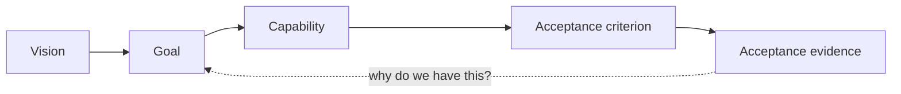
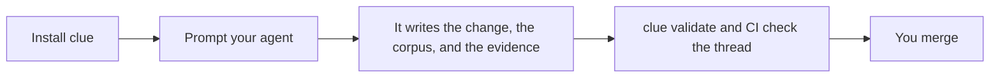

## The thread

Pick up any artifact and follow it back to why it exists, or forward to what proves it. `clue` checks that no arrow is missing. It does not run your tests, it cannot tell you that a test proves the right thing, and it cannot tell you the goal was worth having. That judgment stays yours, at the merge.

## What you work with

- **The skills** in `.agents/skills/`: the process your coding agent follows.
- **The corpus** under `docs/`: the lasting record of the system as it exists.
- **`clue`**: the command-line judge that checks the corpus and its evidence.
- **Cliewen**: the name of the method that ties them together.

## Three moves

Install takes one command. Prompting takes ordinary words. The only step Cliewen refuses to do for you is the last one.

## Next

[Start with what Cliewen is and why it exists.](./what-is-cliewen)
