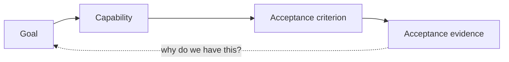
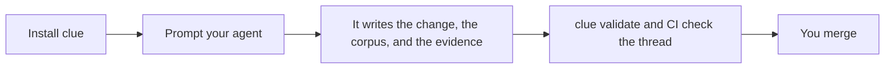

## The thread

Pick up any artifact and follow it back to why it exists, or forward to what proves it. `clue` checks that no arrow is missing. It does not run your tests, it cannot tell you that a test proves the right thing, and it cannot tell you the goal was worth having—that judgment stays yours, at the merge.

## Three names, three things

- **Cliewen** — the methodology.
- **`clue`** — the deterministic command-line judge.
- **The corpus under `docs/`** — the durable record of the system as it exists.

## Three moves

Install takes one command. Prompting takes ordinary words. The only step Cliewen refuses to do for you is the last one.

## Next

[Start with what Cliewen is and why it exists.](./what-is-cliewen)
