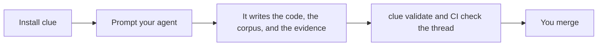

## Three moves

Install takes one command. Prompting takes ordinary words. The only step Cliewen refuses to do for you is the last one.

## Next

[Start with what Cliewen is and why it exists.](./what-is-cliewen)
