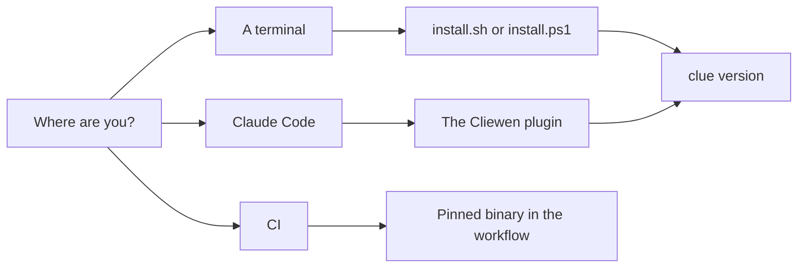

# Install

Cliewen ships as one binary called `clue`. Installing it changes nothing in any repository: it is a command-line judge you point at a project when you choose to. Nothing is written into a repository until you run `clue init` yourself.

There are three routes, and they all install the same checksum-verified binary from the same release.



## Prerequisites

- **Required:** Git (`git`).
- **Required for the install script:** `curl` or `wget` and `sha256sum` or `shasum` on macOS and Linux; PowerShell on Windows. All are normally present.
- **Required:** permission to add one directory to your user `PATH`. No administrator rights are needed.
- **Optional:** the Go toolchain, if you prefer installing from source.
- **Recommended later for GitHub:** an authenticated [GitHub CLI](https://cli.github.com/) (`gh`) for the pull-request loop. Cliewen itself works with plain Git and any forge.

Node.js and npm are needed only to build this guide or contribute to Cliewen itself.

## Install `clue`

One command, on any supported machine:

::: code-group

```sh [macOS and Linux]
curl -fsSL https://cliewen.dev/install.sh | sh
```

```powershell [Windows]
irm https://cliewen.dev/install.ps1 | iex
```

```sh [Any host with Go]
go install github.com/cliewen/cliewen/cmd/clue@latest
```

:::

Working inside Claude Code? [Install from the plugin instead](./plugin) and skip the context switch; it runs the same script and installs the same binary.

Then open a new terminal and run `clue version` — a `PATH` change does not reach an already-running shell. It should print the version you installed, for example `clue 0.7.0`. On macOS and Linux the script does not edit your shell profile: if `~/.local/bin` is not already on `PATH`, the script prints the exact `export PATH=…` line to add.

The script detects your operating system and architecture, downloads the matching release binary, and **verifies it against the release's `SHA256SUMS` before installing anything**; a mismatch stops with nothing written. It installs to `~/.local/bin` (macOS and Linux) or `%LOCALAPPDATA%\Programs\clue` (Windows) and needs no administrator rights. Set `CLUE_INSTALL` to choose a different directory, or `CLUE_VERSION` to pin a release. You are piping a script into a shell, so read it first if you prefer: [install.sh](https://cliewen.dev/install.sh) and [install.ps1](https://cliewen.dev/install.ps1) are short, and the manual steps below do the same work by hand.

The Go route installs under `$(go env GOPATH)/bin`, which you may need to add to `PATH` yourself; it reports `dev` rather than a release version unless you install a tagged version.

::: details Install by hand instead — release assets, checksums, and macOS Gatekeeper

To install by hand — or on a machine where neither script can run — open the [latest Cliewen release](https://github.com/cliewen/cliewen/releases/latest) and download `SHA256SUMS` plus the binary for your machine into an otherwise empty download directory:

| Machine | Release asset |
|---|---|
| Windows x64 | `clue-<version>-windows-amd64.exe` |
| Windows ARM64 | `clue-<version>-windows-arm64.exe` |
| macOS on Intel | `clue-<version>-darwin-amd64` |
| macOS on Apple silicon | `clue-<version>-darwin-arm64` |
| Linux x86-64 | `clue-<version>-linux-amd64` |
| Linux ARM64 | `clue-<version>-linux-arm64` |

Then:

1. Verify the downloaded binary's SHA-256 matches its line in `SHA256SUMS`.

| System | Built-in checksum command |
|---|---|
| Windows PowerShell | `Get-FileHash <asset> -Algorithm SHA256` |
| macOS | `shasum -a 256 <asset>` |
| Linux | `sha256sum <asset>` |

2. Rename the binary to `clue.exe` on Windows or `clue` on macOS and Linux. On macOS and Linux, also make it executable with `chmod +x clue`.
3. Move it into a directory on your user `PATH`. On Windows, a folder such as `%LOCALAPPDATA%\Programs\clue` works once added through "Edit environment variables for your account." On macOS and Linux, `~/.local/bin` is a common choice; add it to your shell's `PATH` if needed.
4. Open a new terminal and run `clue version`. It should print the version you downloaded, for example `clue 0.7.0`.

The macOS binaries are unsigned and not notarized, so a binary you download through a browser can be blocked by Gatekeeper. First confirm the checksum matches, try `clue version` once, then open **System Settings → Privacy & Security** and click **Open Anyway**. Apple documents this exception in [Open a Mac app from an unknown developer](https://support.apple.com/guide/mac-help/open-a-mac-app-from-an-unknown-developer-mh40616/mac). The install script avoids this: a download made outside the browser carries no quarantine attribute.

:::

## Stay current

To find out whether there is anything to upgrade to, run `clue latest`. It reports the newest release and, when you are behind, the installation route for the machine you are on plus the `clue migrate` sequence that moves the repository. It installs nothing, writes nothing in your repository, and exits 0 even when it cannot reach the network — so it is safe to run from a script or a coding agent's session start, where `--quiet` keeps it silent unless there is something to say.

Upgrading later means re-running the same install command. That moves the binary only — for a repository already using Cliewen it is half an upgrade; preview and apply the coordinated corpus and carrier migration with `clue migrate`, as [Operate safely](./operations) explains.

## Next

[Install from inside Claude Code instead.](./plugin)
