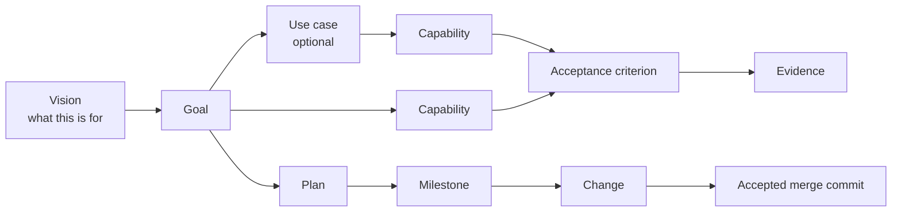

# Vision and use cases

A Cliewen corpus can tell you that some behavior is proven. Until now it could not tell you why anyone wanted the product at all.

This page covers the two artifacts that close that gap: a **vision**, which every corpus may have one of, and **use cases**, which most corpora need none of.

## Two threads, meeting at the goal



The top path is the **intent thread**: what the product means. The bottom path is the **delivery thread**: how that meaning gets built. They touch at the goal and nowhere else.

Keeping them apart has a practical payoff. A plan is not a requirement, a change is not a unit of meaning, and shipping a feature does not by itself change what the product is for. That is why editing code does not oblige you to edit the vision, and why closing a campaign does not retire anything in the intent thread.

## What each artifact answers

| Artifact | Answers | Does not answer |
|---|---|---|
| Vision | What is this product for, and what is outside it? | Which features, in what order |
| Goal | Who wants something, and why? | How an actor gets it |
| Use case | What does one actor do, end to end? | What proves any of it works |
| Capability | What can the system do? | Why anyone wanted it |
| Acceptance criterion | What would prove it? | Anything else |

When one of these starts answering a neighbor's question, link instead of repeating. A vision that lists goals turns into a roadmap and stops being read. A use case that restates criteria becomes a second place to keep them correct.

## The vision

One file per corpus, at `docs/vision.md`, with the identity `VIS-001`. About one screen, because it gets read while orienting and its length is a cost paid on every read.

It answers what the product or system is, whom it serves, what problem it addresses, what value it intends to create, what is in scope and what is deliberately out, what principles constrain its direction, how you would recognize that it is succeeding, and which assumptions are still uncertain.

It is not a roadmap, a backlog, an architecture document, a requirements list, or marketing copy. It needs no business case, and it works the same for a commercial product, an internal service, a library, or an open-source project.

Goals link up to it (`links: [VIS-001]`); the vision does not list them. Edit it when the direction changes, not when a feature ships.

## When a use case earns its place

Write one when it changes what a reader understands:

- an actor's journey crosses several capabilities;
- ordering, alternatives, or failure recovery carries meaning;
- the criteria are each locally correct and still do not add up to the outcome;
- several actors collaborate through the system;
- an existing system holds behavior that no single capability explains.

Skip it when a capability and its criteria already describe the behavior, when there is no real actor interaction, when it would restate a goal, or when the subject is internal implementation behavior that design, architecture, a constraint, or a decision record already owns.

**Nothing counts use cases.** `clue validate` never requires one, `clue validate --intent` prints no percentage, and zero use cases is a perfectly good number. A coverage figure over an optional artifact reads as a target, and the only way to move it is to write journeys nobody needed.

The agent recommends for or against one and says why. You decide.

### A use case worth writing

Cliewen's own `UC-001` describes a team adopting Cliewen in a repository that already has a specification corpus. That journey runs through four capabilities. Onboarding materializes the convention, extraction rehearses and then transforms the existing corpus, the judge decides whether the result holds, and local verification is what a contributor actually runs.

Each of those is separately proven. What none of them says is that the team must be able to stop, or be stopped, before their original corpus is deleted. The rehearsal step exists so a human sees what would happen before anything changes. That sentence has no home in any one capability, which is what makes the use case worth its file.

```yaml
id: UC-001
type: use-case
status: active
links: [G-001, CAP-001, CAP-003, CAP-002, CAP-008]
title: A team adopts Cliewen in a repository that already has a specification corpus
```

The body carries four required sections (`## Actors`, `## Trigger`, `## Main flow`, `## Outcome`), plus preconditions, alternative and failure flows, and open questions when they carry meaning.

### A use case not worth writing

`clue id next CAP` allocates the next capability number. An actor runs it, gets an identity, and the ledger records the reservation.

You could write that as a use case. It would have one actor, one step, and no alternative flow worth naming, and every sentence in it would already appear in the capability and its criteria. The result is a file that has to be kept correct forever and tells nobody anything. So Cliewen has no use case for it, and no check complains.

The test is not complexity. It is whether removing the use case would lose something.

## How the links run

A use case names the goal it serves and every capability it crosses. A goal names the vision. Nothing points back the other way: a capability does not name its use cases.

That keeps each connection written once, so the two ends cannot drift apart. It also keeps `clue context` bounded: reading upward from a goal or a vision would drag most of the corpus into the answer.

For the direction the links do not run in, the command names rather than follows:

```text
$ clue context CAP-003
===== CAP-003 | docs/capabilities/CAP-003-extract/README.md =====
...

----- 1 use case(s) naming this artifact; not followed -----
UC-001 | A team adopts Cliewen in a repository that already has a specification corpus | docs/use-cases/UC-001-adopt-cliewen-in-an-existing-repository.md
```

You get the identity, the title, and the path. No content is pulled in and no edge is traversed, so the slice you asked for is exactly the slice you get. Reading the use case is your next command, made on evidence.

## Starting from nothing: the interview

Suppose you open a new repository and say:

> I want to build a service that helps local running clubs organize weekly runs.

That is enough to start. The agent asks a few questions, then a few more shaped by your answers: who uses this, what they are trying to get done, what is deliberately not in it, what would tell you it was working. It asks about running clubs, not about goals and capabilities; translating into Cliewen's vocabulary is its job, not yours.

It stops when another question would not change what it writes. Then it summarizes what it understood in plain language and asks you to correct it. Only after that does any of it count as agreed.

What comes out is a proposed vision, some initial goals, and a recommendation for each use case it considered, including the ones it is not recommending, with the reason.

If you would rather it just drafted something from the one sentence, say so and it will. What changes is how much gets written, not how honestly it is labeled: the vision stays `draft` with `provenance: inferred`, and every guess appears as a stated assumption or an open question rather than as something you said.

## Starting from an existing system: inference

In a repository that already exists, the agent reads before it asks. The README and other documentation, architecture and design material, source and public APIs, tests, command-line help, configuration, package metadata, deployment definitions, existing decision records, the change history inside the repository, and examples.

Then it writes a draft that cites the sources behind each material claim, keeps what it observed apart from what it concluded, and names the contradictions and stale documents it found instead of smoothing them over. It asks you only what the repository genuinely cannot answer.

One line it does not cross: **code shows what a system does, and cannot show why anyone wanted it.** Strategic intent gets asked about or marked as an assumption, never derived from implementation structure. Where two sources disagree and the disagreement affects durable meaning, the conflict gets recorded and the call is yours.

A partly documented repository is the normal case. Missing documentation is a reason to mark uncertainty, not a reason to invent certainty.

## What `clue` checks, and what it refuses to

`clue validate` checks form:

- at most one vision, at `docs/vision.md`, with a type that matches;
- no unreplaced scaffold bootstrap left behind;
- use cases in `docs/use-cases/` with filenames matching their identity;
- each use case naming at least one goal and at least one capability;
- each use case carrying its four sections;
- links that resolve and identities that are unique.

It does not check, and will not pretend to check, whether a vision states the right direction, whether a use case describes real users, whether all the actors have been found, whether a journey is complete, or whether any of it will produce value. Those stay with the reviewer and the merge boundary, which is where judgment belongs.

`clue validate --intent` reports what a corpus has:

```text
$ clue validate --intent
vision: VIS-001 Cliewen — durable intent that a machine can check... (draft, inferred — no human has confirmed it) at docs/vision.md
use case: UC-001 A team adopts Cliewen in a repository... (active) crosses CAP-001, CAP-003, CAP-002, CAP-008
```

Note the provenance. An agent drafted that vision and no human has confirmed it, and the report says so rather than presenting a conclusion as an agreement.

## Coming from 0.22.0

Nothing breaks. A repository that has neither artifact stays valid, and no work is blocked for lacking them.

Run `clue migrate`. It adds the empty `docs/use-cases/` folder and its index row, which is structure with nothing asserted in it, and reports a missing vision as a notice:

```text
docs/vision.md (MIG-014): this corpus states no vision, and that is valid;
migration cannot write one because nothing in a repository proves why a
product exists — elicit or infer it in a reviewed change, or leave it
absent deliberately
```

Migration will not draft one for you. A vision is the single artifact in the corpus with no evidence base in the repository, so a tool that produced one would be inventing it.

New repositories are treated differently on purpose: `clue init` writes a marked vision bootstrap, and validation stays red until it is replaced. That way a repository starting today starts with a direction, while a repository that has been running for a year is not punished for a file that did not exist when it adopted.

The distinction between *not yet established* and *quietly forgotten* is handled in one place: a full change's acceptance brief states the vision it proceeds under, or states that the repository has none. Saying so once, where a reviewer reads it, is cheaper than a tool asking forever.

## Next

[See where the durable artifacts live in the corpus.](./corpus)
