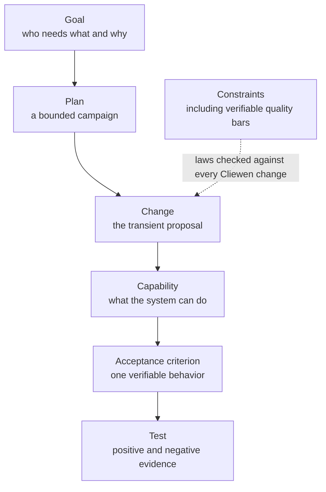

# The verifiable thread

Cliewen organizes system knowledge as a graph with one red thread from motivation to executable evidence.

## Goal

A goal states who wants an outcome and why. Proposed goals form the inbox; accepting a goal says it is real, not that it must be built immediately.

## Plan

A plan is a finite campaign serving a goal. Its milestones have explicit exit criteria and evidence. Completed plans are frozen rather than rewritten, so the plan index also records what the project has achieved.

## Change

Cliewen does not own every repository edit. A plain change affects no product behavior, intent, evidence, decision, plan, policy, or methodology. It uses an ordinary branch, checks relevant to the edited surface, a pull request, and human merge, without a CH number or corpus work.

A Cliewen change is a branch-sized proposal. Full changes use a transient workspace under `/changes/CH-xxx-*` for the proposal, ordered tasks, and blocking questions. The workspace is deleted during the digest because the current system truth belongs in `/docs`, while Git keeps the proposal history.

Small changes can use the light tier when they make no decision, change no acceptance meaning, perform no semantic plan mutation, and touch no methodology carrier. The ready pull-request description becomes the proposal, but the branch and human merge boundary remain.

## Capability and acceptance criterion

A capability owns three views: a plain-language explanation, Gherkin acceptance criteria, and implementer-facing design. An active criterion has a stable ID and both positive and negative focused tests. If its meaning changes, the old ID is retired as a tombstone and a new one is minted.

That immutability matters. A test tagged `AC-042` should always mean the same promise, even years later.

## Constraints

Constraints are rules a Cliewen change must not break: a law, license, policy, project convention, or a verifiable quality bar such as a coverage floor or a maximum onboarding time. Each one names its source and whether a machine, agent, or human enforces it, and every Cliewen proposal is assessed against all of them.

## Four actors, one boundary

Skills carry process knowledge, `clue` is the deterministic judge, protected CI is the wall, and the human controls acceptance. The machine does not pretend to understand whether a criterion is valuable; the human does not have to repeat a locally completed code review, but the agent can never perform the merge that accepts its own work. CI becomes a wall only when its PR check is required and branch protection blocks integration without it.

## Next

[See where the durable artifacts live in the corpus.](./corpus)
