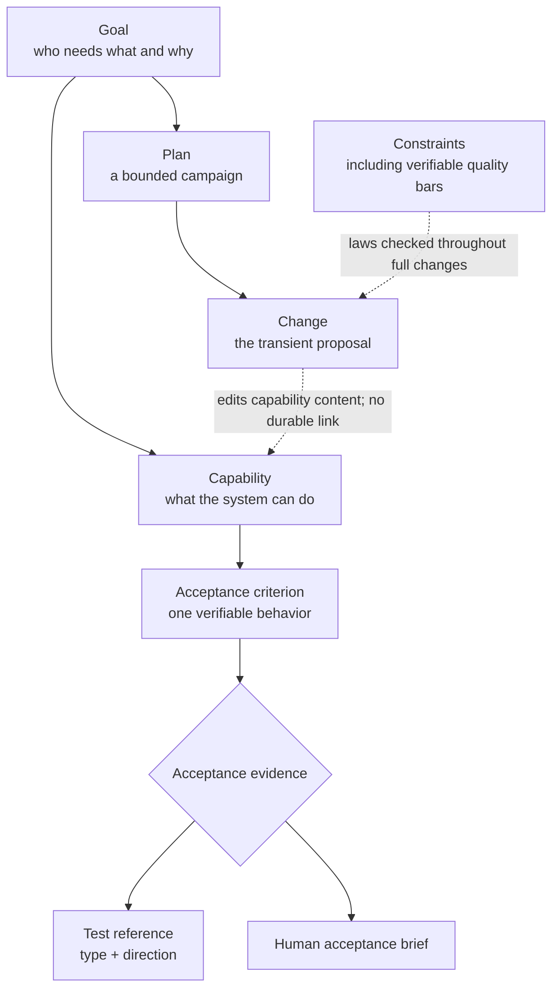

# The verifiable thread

Cliewen organizes system knowledge as a graph with one verifiable thread from motivation to acceptance evidence, and a separate delivery thread that acts on capability content without leaving a durable link once the work lands.

```mermaid
flowchart TD
    G[Goal<br/>who needs what and why] --> P[Plan<br/>a bounded campaign]
    P --> CH[Change<br/>the transient proposal]
    G --> CAP[Capability<br/>what the system can do]
    CAP --> AC[Acceptance criterion<br/>one verifiable behavior]
    AC --> E{Acceptance evidence}
    E --> T[Test reference<br/>type + direction]
    E --> H[Human acceptance brief]
    C[Constraints<br/>including verifiable quality bars] -. laws checked throughout full changes .-> CH
    CH -. edits capability content; no durable link .-> CAP
```

## Goal

A goal states who wants an outcome and why. Proposed goals form the inbox; accepting a goal says it is real, not that it must be built immediately.

## Plan

A plan is a finite campaign serving a goal. Its milestones have explicit exit criteria and evidence. Before an agent starts or resumes milestone work, it checks that the plan still holds and repeats that check when new evidence challenges the campaign. A passing check leaves no record. A failed check pauses affected work for human direction; the selected revision is declared in the plan before work resumes, and it needs a decision record only when it makes a future-shaping choice. Completed plans are frozen rather than rewritten, so the plan index also records what the project has achieved.

## Change

A change is how work reaches the corpus, and it is the one part of the thread that does not stay. Cliewen recommends **simple** when the work keeps every promise the repository has made, and **full** when it changes one. Simple work, such as a bug fix against an unchanged criterion or a refactoring, has no change ID and no extra bookkeeping. Full work, such as a new acceptance criterion or a changed decision, gets a temporary workspace under `/changes/CH-xxx-*`. Before merge, the *digest* folds what the change means into `/docs` and deletes the workspace.

The agent states its recommendation before editing and looks again when it learns more. If you overrule a full recommendation, the work goes ahead as simple and the commit message records the risk. Choosing a route never gives the agent permission to push; you and your repository's permissions control integration. [The change loop](./change-loop) has the details.

## System overviews

Every corpus has two concise system views. `docs/architecture/README.md` explains actors, components, boundaries, and durable technology choices. `docs/design/README.md` explains cross-cutting flows, interactions, and patterns. Capability `design.md` files keep the local detail. The agent reviews these documents for impact on every change, updates the one that answers the reader's question, and links instead of repeating the same explanation. Use Mermaid when a diagram makes a relationship or flow easier to understand; keep an SVG when Mermaid cannot show it clearly.

## Capability and acceptance criterion

A capability owns three views: a plain-language explanation, Gherkin acceptance criteria, and implementer-facing design. Criterion IDs use the exact canonical grammar `<PREFIX>-<digits>[lowercase-suffix]`, where `<PREFIX>` may contain uppercase hyphen-separated segments, so stable brownfield IDs such as `SNAP-SQS-001` and `ADP-045b` do not need renumbering; only supported evidence-carrier aliases normalize their syntax. A new or revised machine-proven criterion declares `Test-type: Unit`, `Integration`, `E2E`, or `Performance` and has supported Go, JVM, or Cucumber evidence classified by that type and positive/negative direction; JVM evidence carries all three parts on one supported Java or Kotlin executable. A genuinely single-direction scenario says so explicitly. `Test-type: Human` routes proof to the pull request acceptance brief and needs no code reference. A genuinely not-yet-proven criterion carries `@draft` on its own tag line without drafting its active siblings or capability, while an unannotated legacy criterion retains the one-supported-reference rule. `clue validate` checks these declarations and references but does not execute tests. If a criterion's meaning changes, the old ID is retired as a tombstone and a new one is minted.

That immutability matters. A test tagged `AC-042` should always mean the same promise, even years later.

## Constraints

Constraints are rules a Cliewen change must not break: a law, license, policy, project convention, or a verifiable quality bar such as a coverage floor or a maximum onboarding time. Each one names its source and whether a machine, agent, or human enforces it, and every Cliewen proposal is assessed against all of them.

## Four actors, one boundary

Skills carry process knowledge, `clue` is the deterministic judge, protected CI is the wall, and the human controls acceptance. A full-change PR begins with an acceptance brief that puts the remaining semantic questions — whether the plan item is still wanted, whether changed criteria fit reality, and what merge binds — in front of the human. The machine does not pretend to answer them; the human does not have to repeat a locally completed code review, but the agent can never perform the merge that accepts its own work. CI becomes a wall only when its PR check is required and branch protection blocks integration without it. The wall enforces admission to merge; it is not acceptance evidence — that remains the criterion's classified executable reference or its Human-class acceptance-brief entry.

## Next

[Read why Cliewen is designed the way it is.](./design)
