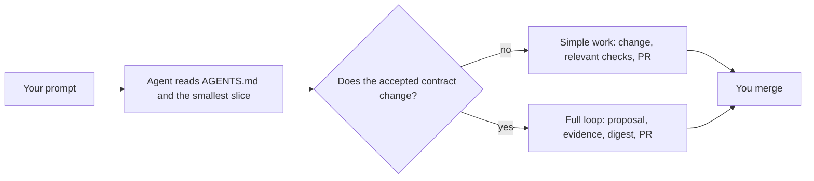

# How to prompt the agent

You do not need to speak Cliewen's internal language. Describe what you want in ordinary terms; the repository's `AGENTS.md` tells the agent which workflow to follow, and the agent tells you which route it recommends before it edits anything.



A Cliewen agent starts by saying *Recommended route: simple* or *Recommended route: full*, followed by its reason and what discovery could change that recommendation. If you do not see that sentence, the agent has not read the repository's routing hub.

## Start something new

After `clue init`, give the agent the first outcome rather than a proposed file layout:

```text
I'm starting a new system that should <outcome>. Help me work out a small first version.
```

The agent should establish the goal, make uncertainty visible, and propose the smallest verifiable plan before implementation. Expect questions. An outcome nobody can observe cannot become an acceptance criterion, so the agent should say that rather than invent one.

## Adopt an existing repository

Use this once, when the repository already contains specifications, decision notes, tagged tests, or other durable intent:

```text
Bring this repository into Cliewen. Keep the links between its existing specifications and tests, and flag anything that disagrees.
```

The agent should route this to the extraction skill as a full change. Its first output is a report-only rehearsal: an inventory and proposed mapping, not a rewritten corpus. Nothing changes until you direct it. [Greenfield and brownfield](./adoption#adopt-one-existing-repository) explains the rehearsal and why every extracted artifact starts as `inferred`.

## Make a routine change

Once the corpus exists, name the behavior and ask for the complete change:

```text
Please add <behavior> and get it ready for review.
```

The agent follows the change loop and leaves the merge decision to a human. "Get it ready for review" is doing real work in that sentence: it asks for the checks, the evidence, and the pull request, not just the code.

## Pick up where you left off

This is the prompt to use after a week away, and it is deliberately short:

```text
What is next?
```

There is no `clue next` command. This prompt works because the plan is a file the agent can read:

1. It reads `AGENTS.md`, the routing hub every agent starts from.
2. It opens the active plan under `docs/plans/` — a plan is a flat `P-xxx-slug.md` file whose milestone table has one row per milestone, with an exit criterion, a status, and an evidence cell.
3. It reports the first milestone whose exit criterion is not yet satisfied by evidence, quoting that row rather than paraphrasing it.
4. It recommends a route for that work and waits, because choosing what to do next is your decision, not its own.

When several plans are open, or the repository may disagree with your memory, ask the agent to make its reasoning explicit:

```text
What is next? Read the active plan, name the first milestone that has no evidence yet, quote its exit criterion, and recommend a route. Do not change anything yet.
```

`clue context <id>` is how the agent bounds what it reads: given a plan, capability, or criterion identity it prints that artifact's outgoing-link slice, so the answer comes from a few relevant files rather than from the whole corpus. `clue refs` and `clue report` answer narrower questions about references and extraction state. All of them read; none of them decide.

## When the honest answer is "let's find out first"

Some questions are not changes yet. When you do not know where the intent lives, or whether the sources agree, ask for investigation instead of implementation:

```text
Before we adopt Cliewen, investigate the risks and unknowns around where our intent lives across <repositories, wiki, tickets>. Find what is still current and what conflicts, then recommend what should live in each repository.
```

That routes to a discovery pass that ends in findings documents, not in a half-finished migration.

## What your prompt does not need to contain

You never have to name a `CH` number, choose a folder, write YAML frontmatter, or tell the agent which skill to load — those are the repository's job and the agent's job. What is worth saying, because the agent cannot guess it: the outcome you want, any constraint that is not negotiable, and whether you want this merged now or explored first.

## Next

[See what one change actually produces.](./first-change)
