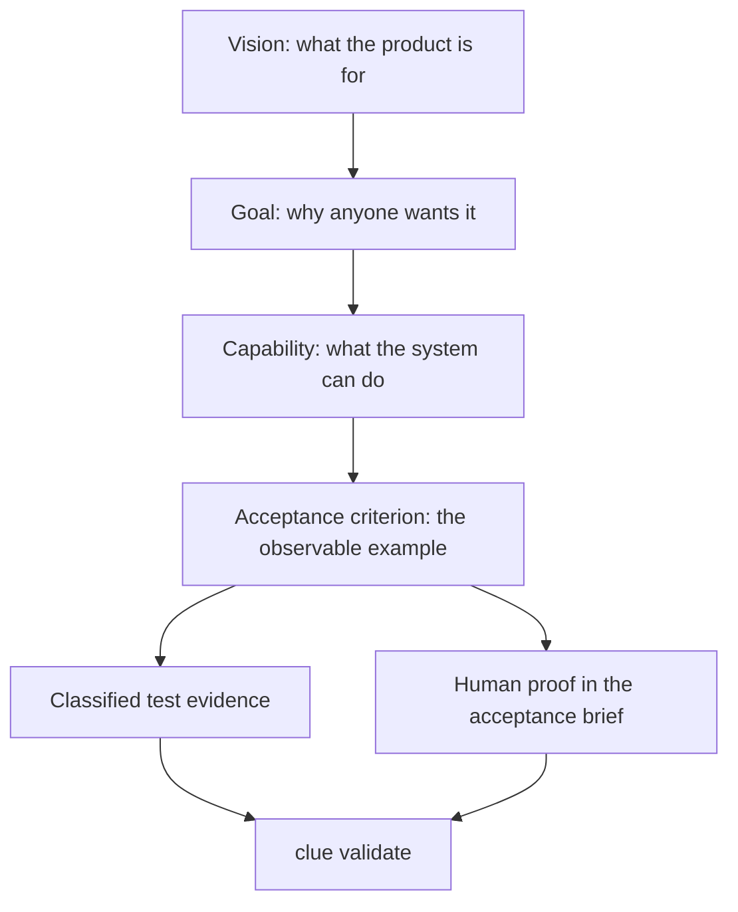
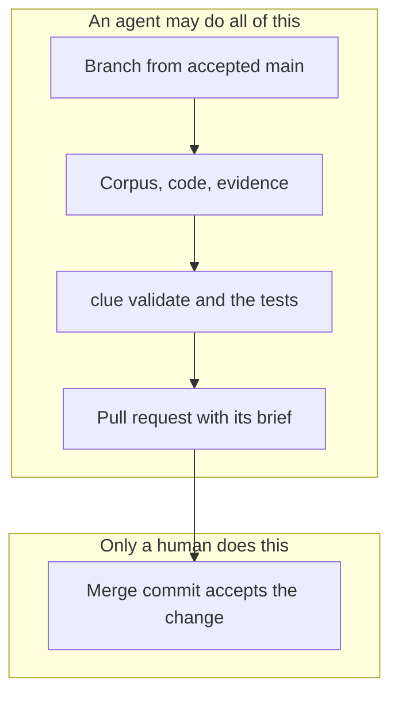

# What is Cliewen?

Cliewen is a methodology and command-line tool for teams that build software with coding agents. It keeps intent, implementation, and evidence connected. Its name comes from the Old English word for a ball of thread, which became *clue*.

The central idea is that the documentation describes the system as it exists now, rather than piling up past change requests. The vision says what the product is for. A goal says who needs an outcome and why, a capability says what the system can do, and each active acceptance criterion names the evidence that proves it. Machine-proven criteria use supported, classified test references. Criteria that only a person can judge use the pull request's acceptance brief. The `clue` command checks that this thread is intact.

That diagram is the core of the product. The rest of this guide explains how to keep those links intact while an agent works quickly.

## What you work with

Day to day, you deal with two things that `clue init` puts in your repository:

- **The skills** under `.agents/skills/` are instructions your coding agent follows: how to plan, investigate, make a change, verify it, adopt an existing repository, and upgrade. [The skills](./skills) explains each one.
- **The corpus** under `docs/` holds the vision, goals, plans, capabilities, criteria, designs, and decisions. Agents read it before they work and update it with the code. [The corpus](./corpus) explains how it is organized.

## Evidence-backed Intent Engineering

That phrase is Cliewen's own description of its approach, not an established industry label, so here is exactly what it means:

1. Human intent is recorded as a vision, goals, capabilities, decisions, constraints, and acceptance criteria that stay in the repository.
2. Every active acceptance criterion declares the evidence by which it is accepted.
3. That evidence is either a classified executable test reference or explicitly identified human verification.
4. Tooling checks mechanically that the chain from intent to evidence is complete.
5. A human decides whether a full change is accepted and merged.

The important word is *backed*. Cliewen makes the connection between intent and acceptance evidence explicit, reviewable, and mechanically checkable. It does not prove that your software fulfills its intent. `clue` validates structure, links, declarations, and supported evidence references, but it does not execute tests, decide whether a test checks the right behavior, or know whether the intent was right. Review and the human at the merge gate make that semantic decision. [The design of Cliewen](./design) explains the boundary in detail.

## Why another workflow?

Coding agents can produce changes faster than people can review them. That moves the bottleneck from writing code to deciding whether a change is correct and safe to merge. A patch can look convincing while missing why the system exists, updating a specification without its tests, leaving a decision in chat, or changing the meaning of an acceptance criterion.

Before it edits anything, a Cliewen agent tells you whether the work is *simple* or *full*. Simple work keeps every promise the repository has already made, such as a bug fix or a refactoring. Full work changes a promise, such as a new acceptance criterion. You choose, and your repository's own rules decide how work gets integrated. For full work, Cliewen separates what a machine can check from what a person must judge:

- The corpus under `/docs` is the system of record.
- A branch is a proposal. The pull request is where authorization happens: the agent may publish a full change, but it cannot accept that change into `main`.
- While the work is in progress, a full change keeps its proposal in a temporary `/changes/CH-xxx-*` folder. Before merge, the agent folds what it means into `/docs` and deletes the folder.
- The `clue` CLI checks structure, links, and acceptance-evidence traceability without executing tests.
- A human accepts a full change by merging it. That person does not have to repeat a code review the agent already completed. Simple work is integrated only with your explicit permission and within what the repository allows.

The pull request is also where hosted CI becomes enforceable, but only when the repository requires its status check and protects `main`. Without a required check and branch protection, a pull request only displays CI results, and an agent could skip the gate without anyone noticing.

## Born from Intent Engineering and spec-driven development

Cliewen builds on [Intent Engineering for Coding Agents](https://intent-engineering-for-coding-agents.github.io/book/) by Cliewen's author, Flemming N. Larsen. That approach records human intent before an agent implements it and keeps the shared context under version control. Cliewen adds the evidence-backed part: intent lives in durable documentation, and `clue` checks the links that discipline alone can miss.

The book's working example of spec-driven development is [OpenSpec](https://github.com/Fission-AI/OpenSpec). OpenSpec proposes a change-sized spec, applies it, and archives it afterwards. Cliewen keeps the proposal for full work but has no archive. Before merge, the temporary `/changes` folder is folded into `/docs` and deleted, and the merge commit keeps the branch's history in the repository. The pull request authorizes the merge but is not where the record lives, so squash and rebase-and-merge are outside the full-change support boundary: they would throw that history away. In Cliewen the documentation is the specification, and every integration must leave it true, whether the work was simple or full. A repository using the book's extended OpenSpec format can be adopted with its IDs and test traceability intact; see [Greenfield and brownfield](./adoption).

Decisions work the same way. A choice that constrains future work is recorded as an ADR, PDR, or IDR, depending on whether it is about architecture, process, or implementation. A decision an agent records starts as `inferred`. Merging the pull request makes it binding, and a human's explicit approval later marks it `verified`. If you turn down a full recommendation and choose simple, the agent does not invent a decision record for your choice. It notes the override and its risk in the commit message.

This avoids two common failures of change-centered specifications: an archive of stale proposals that readers must reconstruct, and a permanent specification that only appears connected to executable evidence.

## What Cliewen is not

Cliewen is not an issue tracker, a project-management service, or a way to remove humans from engineering decisions. It is also not a replacement for test runners: `clue` validates references but does not execute tests.

::: details The exact evidence rules — the reference your agent needs, not your first read

Canonical criterion IDs use `<PREFIX>-<digits>[lowercase-suffix]`, so brownfield identities such as `SNAP-SQS-001` and `ADP-045b` remain stable; Go/JVM named forms remove prefix hyphens and literal JVM/Cucumber tags may use underscores as documented aliases. A new or revised machine-proven criterion declares its proof type and needs classified positive and negative evidence through supported Go test names, per-executable Java/Kotlin JUnit method tags or the stable JVM test-name form, or Cucumber scenario tags, unless it explicitly records `(single-direction)`. JVM metadata split across methods or inherited from a class receives no evidence credit. An unannotated legacy criterion keeps the one-supported-reference rule. A genuine `Test-type: Human` criterion is proven by its acceptance-brief line without fake code evidence, while `@draft` exempts only one not-yet-proven criterion inside an otherwise active file.

:::

## Next

[See what you can actually do with it.](./what-you-can-do)
