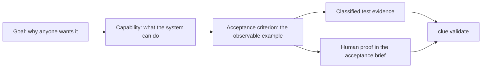
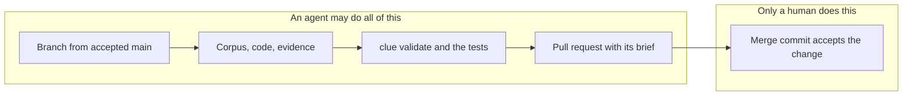

# What is Cliewen?

Cliewen is a methodology and a command-line tool for building software with coding agents while keeping intent, implementation, and evidence connected. Its name comes from the Old English word for a ball of thread: the same word that became *clue*.

The central idea is simple: the durable documentation describes the system as it exists, not a pile of past change requests. A goal leads to a capability, a capability owns acceptance criteria, and each active criterion reaches its declared acceptance evidence. Machine-proven criteria use supported, classified test references; genuine Human-class criteria use the pull request acceptance brief. The `clue` command checks that this thread is intact.

That picture is the whole product. Everything else on this site is about keeping one of those arrows from going missing while an agent works fast.

## Evidence-backed Intent Engineering

That phrase is Cliewen's own description of its approach, not an established industry label, so here is exactly what it means:

1. Human intent is recorded as durable goals, capabilities, decisions, constraints, and acceptance criteria.
2. Every active acceptance criterion declares the evidence by which it is accepted.
3. That evidence is either a classified executable test reference or explicitly identified human verification.
4. Tooling checks mechanically that the chain from intent to evidence is complete.
5. A human decides whether a full change is accepted and merged.

The word doing the work is *backed*. Cliewen makes the connection between intent and acceptance evidence explicit, reviewable, and mechanically checkable. It does not prove that your software satisfies your intent: `clue` validates structure, links, declarations, and supported evidence references, but it does not execute tests, judge whether a test asserts the right behavior, or know whether the intent was right in the first place. Semantic acceptance stays with review and with the human at the merge gate. [The design of Cliewen](./design) draws that boundary in full — it is deliberate, and it is why a green check here stays worth trusting.

## Why another workflow?

Coding agents can produce changes faster than people can review them. That moves the bottleneck from writing code to deciding whether a change is correct and safe to merge. A patch can look convincing while missing why the system exists, updating a specification without its tests, leaving a decision in chat, or changing the meaning of an acceptance criterion.

Cliewen first recommends simple work when the accepted contract remains intact and the full loop when it changes; the user chooses, and repository policy controls integration. Inside a chosen full loop it separates mechanical checks from human judgment:

- The corpus under `/docs` is the system of record.
- A branch is a proposal, and the pull request is the authorization boundary: the agent may publish a full candidate but cannot accept that full change into `main`.
- A full change keeps its working delta in `/changes/CH-xxx-*`; the digest deletes that workspace before merge.
- The `clue` CLI checks structure, links, and acceptance-evidence traceability without executing tests.
- A human controls full-loop acceptance by merging; this safeguard does not require repeating a code review already completed locally. Simple integration instead requires explicit user authority and repository permission.

The pull request is also where hosted CI becomes enforceable when the repository requires its status check and protects `main`. A pull request without a required check and branch protection only displays CI; the combination is what prevents an agent from silently skipping the gate.

## Born from Intent Engineering and spec-driven development

Cliewen builds on the ideas in [Intent Engineering for Coding Agents](https://intent-engineering-for-coding-agents.github.io/book/), written by Cliewen's author, Flemming N. Larsen: human intent is written down before an agent implements it, and the shared ground between human and agent lives in the repository under version control. Cliewen carries that approach one step further, and the *evidence-backed* half of the label is precisely that step: the durable documentation is where that intent lives, and the `clue` binary enforces what the book otherwise leaves to discipline.

The book's working example of spec-driven development is [OpenSpec](https://github.com/Fission-AI/OpenSpec), where a change-sized spec is proposed, applied, and then moved to an archive folder to keep the workspace clean. Cliewen keeps that proposal layer for full work but needs no archive step: by the time a pull request merges, the transient `/changes` workspace has been digested into the durable documentation under `/docs` and deleted, and the supported merge commit keeps the accepted branch history in the repository. The pull request authorizes that full-loop merge but is not the system of record, so squash and rebase-and-merge are outside the full-change support boundary. Instead of a spec that goes stale after implementation, the documentation is the spec, and every integration is required to leave it true whether its recommended route was simple or full. A repository already using the book's extended OpenSpec format can be adopted with its IDs and test traceability intact; the [greenfield and brownfield guide](./adoption) shows how.

Decisions inside a full loop follow the same rhythm. A future-shaping choice routes by subject to ADR, PDR, or IDR. A decision an agent records is born `inferred`; merging the pull request makes it binding, and later explicit human approval promotes it to `verified`. A user who declines the full recommendation chooses simple process for that integration; the agent records the override risk in Git history rather than manufacturing a corpus decision.

That combination prevents two common failures of change-centered specifications: a growing archive of stale proposals that must be reconstructed to understand current behavior, and a polished permanent specification whose connection to executable evidence is only assumed.

## What Cliewen is not

Cliewen is not an issue tracker, a project-management service, or a way to remove humans from engineering decisions. It is also not a replacement for test runners: `clue` validates references but does not execute tests.

::: details The exact evidence rules — the reference your agent needs, not your first read

Canonical criterion IDs use `<PREFIX>-<digits>[lowercase-suffix]`, so brownfield identities such as `SNAP-SQS-001` and `ADP-045b` remain stable; Go/JVM named forms remove prefix hyphens and literal JVM/Cucumber tags may use underscores as documented aliases. A new or revised machine-proven criterion declares its proof type and needs classified positive and negative evidence through supported Go test names, per-executable Java/Kotlin JUnit method tags or the stable JVM test-name form, or Cucumber scenario tags, unless it explicitly records `(single-direction)`. JVM metadata split across methods or inherited from a class receives no evidence credit. An unannotated legacy criterion keeps the one-supported-reference rule. A genuine `Test-type: Human` criterion is proven by its acceptance-brief line without fake code evidence, while `@draft` exempts only one not-yet-proven criterion inside an otherwise active file.

:::

## Next

[Install `clue` with one command.](./install)
