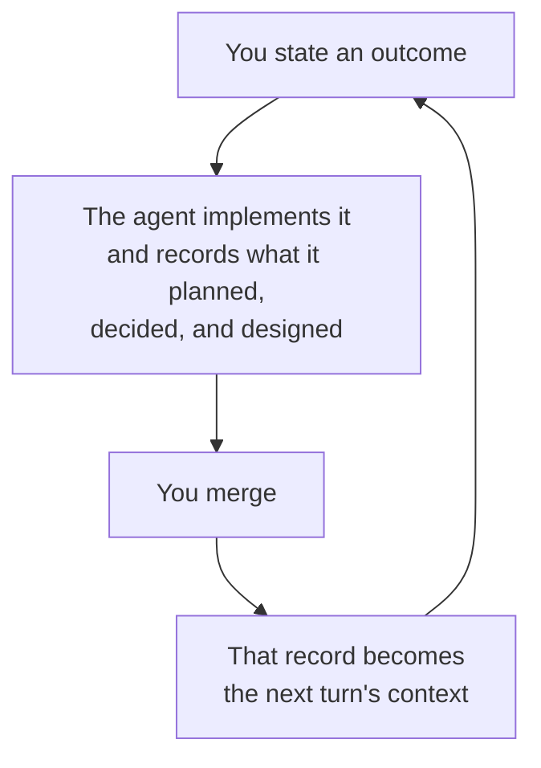

# What you can do with it

Cliewen is for repositories where coding agents make real changes through pull requests. That is the only prerequisite. You do not need a background in spec-driven development or Intent Engineering; those ideas explain Cliewen's origins, not how to get started.

If you already know spec-driven development, the difference is small. SDD records intent before implementation, usually in a proposal that is later archived. Cliewen documents the system itself and connects each promise to its evidence. The documentation is the specification, so every change must leave it true.

## It is not prompt engineering

This is the most common first guess, and the answer is no.

Prompt engineering tunes what you say to a model. It can help, but it disappears when the session ends. Cliewen focuses on what remains in the repository. The next agent, teammate, or future you can read a durable record instead of reconstructing intent from a lost chat log.

You still have to say what you want, and some ways of saying it work better than others. [How to prompt the agent](./prompting) collects the sentences worth copying. But none of them is a magic incantation, and the page says so: they work because the repository already holds what the agent needs to read.

## You get the change and its record, in the same pass

Cliewen produces the code and its durable record together. A change that leaves the documentation untrue cannot pass the gate. [What one change produces](./first-change) follows one change from your request to a merge commit, using artifacts and command output from a real run.

"Code" is the wrong word for what a change is made of, and this repository is the example, because Cliewen runs on itself. The same loop produced the `clue` binary in Go, this guide in Markdown, the six generated agent skills under `.agents/skills/`, the reusable CI workflow other repositories call, the release-gate script, and the `AGENTS.md` routing hub that tells an agent where to start. Cliewen does not care which of those a change touches. It cares that the change leaves the documentation true and its acceptance criteria evidenced.

One boundary matters here: the supported evidence harvesters read Go, JVM, and Cucumber test names and tags. A criterion proven by a shell script, operational procedure, or human judgement declares `Test-type: Human`. Its proof is a line in the pull request acceptance brief, not an executable reference. That is supported, but "any artifact" describes what a change can include, not what Cliewen can machine-prove. [Operate safely](./operations) gives the full support boundary.

## The loop that pays you back

The last arrow matters most. These records are not paperwork; they are the next turn's context.

*What is next?* works as a prompt because the plan is a file with a milestone table, not because anything remembered your last session. `clue context <id>` gives an agent a small, relevant slice to read because the links between artifacts were written down while the reasoning was fresh. A decision made three months ago does not have to be re-derived, re-argued, or guessed at from a diff, because it is a record with its rejected alternatives still attached.

This is where the method pays off. In a typical agent workflow, each session starts close to zero because the reasoning was in a chat that is no longer available. Under Cliewen, each turn leaves a better brief for the next agent, teammate, or new hire. The overhead is front-loaded and visible: you pay it on the first change and benefit from it later. [The design of Cliewen](./design) explains that trade, including when it is not worth making.

## During the work

Decisions become records instead of disappearing into chat. They start as `inferred`, meaning that no human has endorsed the reasoning yet. Constraints such as a licence, policy, or coverage floor are assessed against every change. `clue context <id>` gives the agent a few relevant files instead of the whole repository. When the right answer is "let's find out first," the work becomes a discovery pass with findings rather than a half-finished migration.

## What remains after merge

A corpus describes the system as it exists, rather than an archive of past change requests. Stable acceptance-criterion identities and enforced positive *and* negative evidence mean `AC-042` keeps the same promise over time. You can trace any artifact back to why it exists and forward to what proves it. Plan milestones carry their exit criteria and evidence, so progress remains answerable across sessions and agents.

## At the merge boundary

`clue validate` gives the same verdict locally and in CI. Branch protection makes that check a wall an agent cannot skip. The acceptance brief puts the remaining semantic decision on one screen: what changed, what it binds, and what only a human can judge. The merge stays yours; it accepts the change as true.

## Bring in existing work

A repository with specifications, decision notes, and tagged tests can be extracted into the corpus in one reviewed pass, while preserving its identities and test links. See [Greenfield and brownfield](./adoption). The method lives in committed files that any coding agent can read.

## What the outcome looks like

A merged pull request whose history contains the proposal, implementation, evidence, and durable record, plus a `docs/` tree that still describes the system accurately.

The fastest way to believe that is to watch the thread break. [See the judge work](./getting-started) takes about five minutes in a disposable repository and deliberately removes a test so you get the real diagnostic.

## Next

[Install `clue` with one command.](./install)
