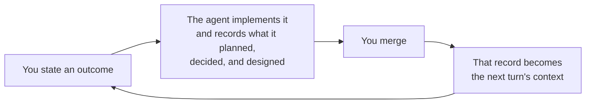

# What you can do with it

Cliewen is for a repository where a coding agent writes real changes that go through pull requests. That is the whole prerequisite. You do not need a background in spec-driven development or Intent Engineering to use it — those explain where Cliewen came from, not what you need to know to start.

If you do already know spec-driven development, the delta is short. SDD takes the discipline of writing intent down before implementation; Cliewen takes that approach further in two ways. An SDD framework documents the *change* — a proposal written, applied, and then archived — so learning what the system does today means reconstructing it from a pile of past proposals. Cliewen documents the *system*, and connects what that documentation promises to the evidence that proves it. The specification cannot go stale after implementation, because the documentation *is* the specification and every change is required to leave it true.

## It is not prompt engineering

This is the most common first guess, and the answer is no.

Prompt engineering tunes what you say to a model. It is useful, and it evaporates when the session ends. Cliewen is about what survives the session: what gets written into the repository. The leverage is not that you phrased the request well — it is that the next agent, the next teammate, or you in three weeks reads a durable record instead of reconstructing intent from a chat log nobody kept.

You still have to say what you want, and some ways of saying it work better than others. [How to prompt the agent](./prompting) collects the sentences worth copying. But none of them is a magic incantation, and the page says so: they work because the repository already holds what the agent needs to read.

## You get the change and its record, in the same pass

Not documentation generated from code. Not code generated from a frozen specification. Both, produced together in one pass and kept consistent by construction — because a change that leaves the documentation untrue cannot pass the gate. [What one change produces](./first-change) walks a single change from the sentence you type to the merge commit, with the artifacts and command output from a real run.

"Code" is the wrong word for what a change is made of, and this repository is the example, because Cliewen runs on itself. The same loop produced the `clue` binary in Go, this guide in Markdown, the six generated agent skills under `.agents/skills/`, the reusable CI workflow other repositories call, the release-gate script, and the `AGENTS.md` routing hub that tells an agent where to start. Cliewen does not care which of those a change touches. It cares that the change leaves the documentation true and its acceptance criteria evidenced.

One boundary belongs here rather than in the small print: the supported evidence harvesters read Go, JVM, and Cucumber test names and tags. A criterion whose proof is a shell script, an operational procedure, or a human judgement declares `Test-type: Human` and is proven by its line in the pull request acceptance brief instead of gaining an executable reference. That is a supported route, not a workaround — but it means "any artifact" applies to what a change is made of, not to what can be machine-proven. [Operate safely](./operations) states the full support boundary.

## The loop that pays you back

Read that cycle once more at the last arrow, because it is the part that is easy to miss. The records are not filing. They are the input to the next turn.

*What is next?* works as a prompt because the plan is a file with a milestone table, not because anything remembered your last session. `clue context <id>` gives an agent a small, relevant slice to read because the links between artifacts were written down while the reasoning was fresh. A decision made three months ago does not have to be re-derived, re-argued, or guessed at from a diff, because it is a record with its rejected alternatives still attached.

The compounding is the point. In an ordinary agent workflow every session starts near zero: the reasoning lived in the chat, and the chat is gone. Under Cliewen each turn leaves the repository a better brief for the next one — for the next agent, for a different agent, and for the person who joins in six months. That is also why Cliewen's overhead is front-loaded and deliberately visible: you pay it on the first change and collect on every one after. [The design of Cliewen](./design) argues that trade directly, including where it is not worth paying.

## What more

**While the work happens.** Decisions get captured as records instead of disappearing into chat — born `inferred`, meaning no human has endorsed the reasoning yet, until one signs them. Constraints — a licence, a policy, a coverage floor — are assessed against every change rather than remembered. `clue context <id>` bounds what the agent reads, so it works from a few relevant files instead of the whole repository. And when the honest answer is "let's find out first", investigation routes to a discovery pass that ends in findings documents rather than a half-finished migration.

**What you are left with.** A corpus that describes the system as it exists, not an archive of past change requests. Acceptance criteria with stable identities and enforced positive *and* negative evidence, so `AC-042` means the same promise years later. Traceability in both directions: from any artifact back to why it exists, and forward to what proves it. Plans whose milestones carry exit criteria and evidence, which is what makes progress answerable across sessions and across different agents.

**At the merge boundary.** `clue validate` gives the same verdict on your machine and in CI. Branch protection turns that check into a wall an agent cannot skip. The acceptance brief puts the remaining semantic decision on one screen — what changed, what it binds, what only a human can judge. And the merge itself stays yours: it is the act that accepts the change as true.

**Bringing in what you already have.** A repository with existing specifications, decision notes, and tagged tests can be extracted into the corpus in one reviewed pass, with its identities and test links intact — see [Greenfield and brownfield](./adoption). None of this is tied to one vendor's coding agent; the method lives in committed files that any agent can read.

## What the outcome looks like

A merged pull request whose history holds the proposal, the implementation, the evidence, and the durable record — and a `docs/` tree that still tells the truth about the system afterwards, without anyone having remembered to update it.

The fastest way to believe that is to watch the thread break. [See the judge work](./getting-started) takes about five minutes in a disposable repository and deliberately removes a test so you get the real diagnostic.

## Next

[Install `clue` with one command.](./install)
